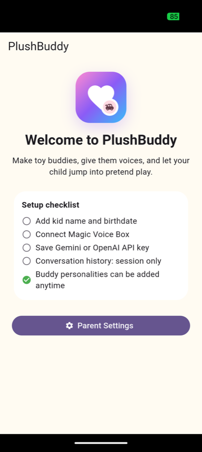
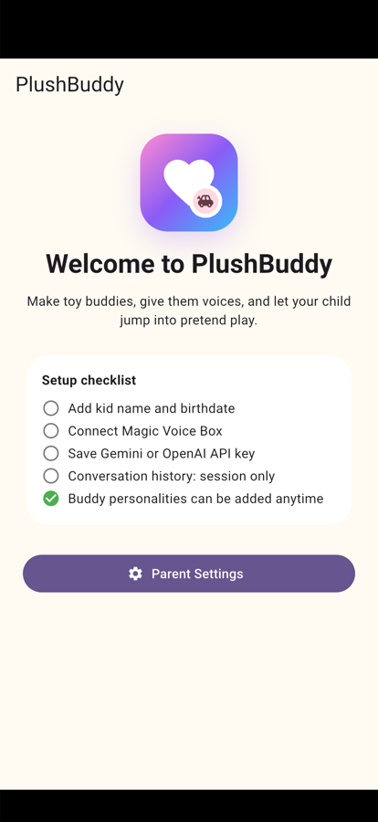
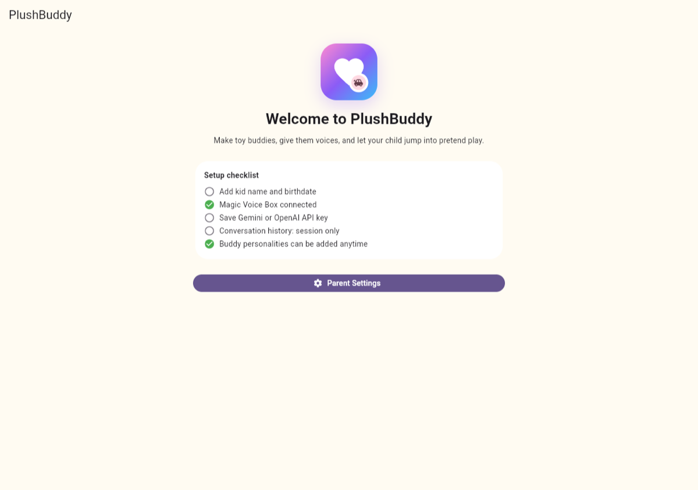
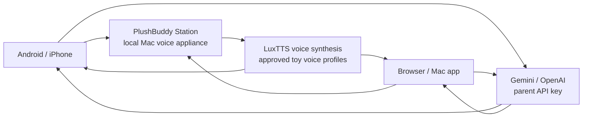
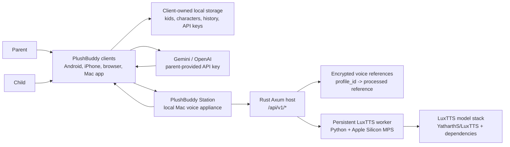

# PlushBuddy

**A local-first pretend-play voice companion for kids’ plush toys.**

PlushBuddy lets a parent create kid profiles, create toy buddies, upload a short
sample of how each toy should sound, approve the cloned voice, and then let a
child talk to that toy through an Android app, iPhone app, browser, or Mac app.

The project combines a cross-platform Flutter client with a local macOS “Magic
Voice Box” that runs the heavier voice model. Cloud LLM reasoning is optional
and uses the parent’s own Gemini/OpenAI API key; the voice profile and family
state stay local.

> This is a prototype/product-engineering project, not a hosted service. It is
> designed to be cloned, built locally, studied, and extended.

## Screenshots

<p>
  
  
  
</p>

| Android app | iPhone simulator | Browser client |
|---|---|---|
| Parent setup and child-mode entry on a real Android device. | Same shared Flutter client running in the iOS simulator. | Local browser client opened from PlushBuddy Station. |

<p>
  
</p>

The Mac app uses the same client experience as the browser version, wrapped in a
native macOS shell and opened from PlushBuddy Station.

## What it does

- Creates up to four kid profiles with names, birthdates, and photos.
- Creates toy-buddy characters per kid, each with photo, personality, guidance,
  persona age, and a separate voice profile.
- Uploads M4A/WAV/MP3/AAC/OGG/WebM voice samples and creates a local voice
  profile through LuxTTS.
- Requires parent approval before a voice can be used in conversation.
- Supports speech or typed child input on mobile, typed input on desktop/web.
- Calls Gemini or OpenAI with parent-provided API keys.
- Redacts/pseudonymizes kid information before cloud reasoning.
- Synthesizes the response locally on the Mac in the selected toy voice.
- Keeps conversation history scoped by kid and character.

## Architecture at a glance

PlushBuddy has four user-facing clients and one local voice appliance:

- **Android app**: primary MVP client for parent setup and child conversation.
- **iPhone app**: same Flutter UI as Android, with iOS-native Keychain, Speech,
  file picker, cloud reasoning, pairing, and playback.
- **Browser client**: local web client served by MacStation; it auto-attaches
  when opened from Station.
- **Mac client app**: native macOS wrapper around the same browser client UI; it
  auto-attaches when opened from Station.
- **PlushBuddy Station / MacStation**: double-clickable macOS setup and voice
  server. It installs/verifies local voice dependencies, starts the Rust host,
  shows service health, opens local browser/Mac clients, and displays pairing QR
  only for Android/iPhone.

MacStation is intentionally not the main app. It is the local **Magic Voice
Box** that runs the heavy voice model.



## Quick start

From a fresh clone on macOS:

```sh
make public-artifacts
```

Artifacts are written outside the source checkout under:

```text
~/Downloads/PlushPal/artifacts
```

Open:

```text
~/Downloads/PlushPal/artifacts/macos/PlushBuddy Station.app
```

Then use Station to open the Mac app, open the browser client, or scan the QR
code from Android/iPhone.

## Documentation map

Start here:

- [Detailed system design and architecture](docs/architecture/SYSTEM_DESIGN.md)
- [System design interview prep](docs/architecture/SYSTEM_DESIGN_INTERVIEW_PREP.md)
- [Codebase directory guide](docs/architecture/CODEBASE_DIRECTORY_GUIDE.md)
- [Android + MacStation MVP architecture notes](docs/architecture/ANDROID_MACSTATION_MVP_ARCHITECTURE.md)
- [QA test plan and latest execution report](docs/release/QA_TEST_PLAN_AND_EXECUTION_2026-06-25.md)
- [Requirements traceability](docs/release/REQUIREMENTS_TRACEABILITY.md)
- [Release checklist](docs/release/RELEASE_CHECKLIST.md)
- [GitHub repository settings](docs/release/GITHUB_REPOSITORY_SETTINGS.md)
- [Contributing guide](CONTRIBUTING.md)
- [Security policy](SECURITY.md)
- [Third-party components](THIRD_PARTY.md)

Historical product specs are under [docs/specifications](docs/specifications).

## License

PlushBuddy is released under the [MIT License](LICENSE).

## What is implemented today

### Product flows

- Parent onboarding with parent PIN.
- Multi-kid support.
- Kid profile name, birthdate, and photo.
- Character creation per kid.
- Character photo upload.
- Character persona traits, parent guidance, and persona age.
- Voice sample upload for each character.
- Voice preview and explicit parent approval.
- Child mode with selected kid and selected character.
- Android/iPhone speech input.
- Typed input for Android/iPhone/browser/Mac.
- Gemini or OpenAI reasoning using parent-provided API key.
- Redaction/pseudonymization before cloud reasoning.
- Station-backed cloned voice playback using LuxTTS.
- Conversation history scoped by kid and character.
- Delete history and delete all local data controls.

### Platform support

| Surface | Status | Notes |
|---|---|---|
| Android | Implemented and buildable | Primary MVP surface. Uses Kotlin native bridge. |
| iPhone | Implemented and buildable | Simulator launches; physical device needs Apple signing/provisioning. |
| Browser | Implemented | Served by MacStation; typed chat and audio playback. |
| Mac client app | Implemented | Native WKWebView shell around the web client. |
| MacStation | Implemented | Native macOS setup shell + Rust host + LuxTTS worker. |
| Windows | Not current MVP | Packaging skeleton exists, but not validated as a product surface. |

## High-level architecture



Key design decision: **reasoning happens in the active client; voice synthesis happens in MacStation**. This keeps child/character state local to the client while keeping the heavyweight voice model on the Mac.

## Runtime flow

### Station startup

1. Parent opens `PlushBuddy Station.app`.
2. Station verifies user storage under `~/Library/Application Support/PlushPal`.
3. Station checks or installs local LuxTTS runtime assets.
4. Station starts the Rust host.
5. Rust host starts a persistent LuxTTS worker.
6. Station shows health status.
7. Parent chooses one of:
   - open PlushBuddy Mac app;
   - open browser client;
   - show QR code for Android/iPhone pairing.

### Character voice creation

1. Parent creates a kid profile.
2. Parent creates a toy character for that kid.
3. Parent uploads a voice sample.
4. Client sends the sample to MacStation over the Station session:
   - browser/Mac clients attach automatically when opened from Station;
   - Android/iPhone use QR pairing because they are external devices.
5. MacStation validates, converts, denoises enough for model input, encrypts the processed reference, and returns a voice `profile_id`.
6. Parent previews the voice.
7. Parent approves only if the preview sounds right.

### Child conversation

1. Child speaks or types.
2. Android/iPhone speech recognition converts speech to text if needed.
3. Client redacts personal info and replaces the kid’s real name with a pseudonym.
4. Client calls Gemini/OpenAI with age/persona/safety prompt.
5. Client receives `{ speech, suggest_trusted_adult }`.
6. Client restores local display personalization.
7. Client sends only `{ profile_id or character alias, response text }` to MacStation.
8. MacStation generates WAV using LuxTTS and the approved voice reference.
9. Client displays text and plays the generated voice.

## Technology stack

| Layer | Technology |
|---|---|
| Shared UI | Flutter / Dart |
| Android native | Kotlin, Android Keystore, SpeechRecognizer, MediaPlayer/AudioTrack style WAV playback, Android file picker |
| iOS native | Swift, Keychain, SFSpeechRecognizer, AVAudioEngine, AVAudioPlayer, UIDocumentPicker |
| Browser client | Flutter web, JavaScript bridge, localStorage, Web Audio playback |
| Mac client | Swift AppKit + WKWebView |
| MacStation shell | Swift AppKit |
| MacStation host | Rust, Axum, Tokio |
| Voice model | LuxTTS through `tools/voice/luxtts_worker.py` |
| Voice fallback/research | Chatterbox, OpenVoice, GPT-SoVITS, F5/TADA experiments |
| Cloud reasoning | Gemini and OpenAI APIs |
| Rust core | domain, policy, provider, session, storage, model lifecycle, mobile bridge crates |
| Packaging | Makefile, Cargo, Flutter, Gradle, Xcode, shell scripts |

## Repository structure

```text
PlushPal/
  apps/
    android/flutter_app/          Shared Flutter app for Android, iPhone, browser
      lib/src/app.dart            Main UI and state orchestration
      lib/src/backend/            Backend abstraction and platform clients
      android/.../MainActivity.kt Android native bridge
      ios/Runner/...swift         iOS native bridge
      web/plushpal_backend.js     Browser backend bridge
    macos/
      station_app/AppShell.swift  Native PlushBuddy Station setup UI
      client_app/AppShell.swift   Native PlushBuddy Mac client shell
    station/macstation_host/      Rust MacStation host
    web/                          Web ownership notes
  crates/                         Reusable Rust crates
  native/                         C/C++/C ABI headers and adapters
  tools/voice/                    LuxTTS and voice experiment scripts
  third_party/                    Small pinned source deps only; model runtimes download outside repo
  packaging/                      macOS, Android, Windows packaging helpers
  docs/                           Architecture, specs, release notes
```

See [CODEBASE_DIRECTORY_GUIDE.md](docs/architecture/CODEBASE_DIRECTORY_GUIDE.md) for the detailed code map.

Local-only/private folders such as `audio-samples/`, old `test-artifacts/`,
old `qa/results/`, model downloads, virtual environments, and packaged build
outputs are intentionally ignored. Current build/test commands write artifacts
outside the repo under `~/Downloads/PlushPal` by default.

## Prerequisites

### Required for most development

- macOS on Apple Silicon for the current LuxTTS path.
- Git.
- Rust via `rustup`; this repo pins Rust 1.86.0 in `rust-toolchain.toml`.
- Flutter stable; current verified version is Flutter 3.44.2 / Dart 3.12.2.
- Python 3.11+ or 3.12 for voice runtimes.
- Xcode Command Line Tools.

### Android

- Android Studio.
- Android SDK and NDK.
- Accepted Android licenses:

```sh
flutter doctor --android-licenses
```

### iPhone

- Full Xcode, not Command Line Tools only.
- CocoaPods.
- iOS simulator runtime.
- Rust iOS targets:

```sh
rustup target add aarch64-apple-ios-sim x86_64-apple-ios aarch64-apple-ios
```

Verified local environment as of June 24, 2026:

- Xcode 26.5
- CocoaPods 1.16.2
- iOS 26.5 simulator runtime
- Flutter 3.44.2

Physical iPhone install requires Apple signing/provisioning.

## First-time setup from a fresh clone

```sh
git clone <repo-url> PlushPal
cd PlushPal
git submodule update --init --recursive
flutter doctor -v
```

Install voice runtime for the MacStation path:

```sh
make setup-luxtts-voice
```

Optional fallback/research voice runtime:

```sh
make setup-chatterbox-voice
```

## Build commands

### Validate Flutter app

```sh
cd apps/android/flutter_app
flutter analyze
flutter test
```

### Build Android APK for local development

```sh
make android-apk
```

Output from this low-level development command:

```text
apps/android/flutter_app/build/app/outputs/flutter-apk/app-debug.apk
```

Install on connected Android device:

```sh
adb install -r apps/android/flutter_app/build/app/outputs/flutter-apk/app-debug.apk
```

### Build iPhone simulator app for local development

```sh
make ios-simulator
```

Output from this low-level development command:

```text
apps/android/flutter_app/build/ios/iphonesimulator/Runner.app
```

### Build unsigned iPhone device app for local development

```sh
make ios-device
```

Output from this low-level development command:

```text
apps/android/flutter_app/build/ios/iphoneos/Runner.app
```

This verifies compilation for device architecture. Installing on a real iPhone requires signing in Xcode.

### Build public local artifacts

For a clean public-repo style build, use:

```sh
make public-artifacts
```

This command builds from an external workspace under `~/Downloads/PlushPal/build`
and writes artifacts under `~/Downloads/PlushPal/artifacts`, so generated files do
not dirty the source checkout. It downloads the LuxTTS source dependency into
`~/Downloads/PlushPal/deps` when needed.

Expected artifacts, depending on installed platform toolchains:

```text
~/Downloads/PlushPal/artifacts/macos/PlushBuddy Station.app
~/Downloads/PlushPal/artifacts/macos/PlushBuddy.app
~/Downloads/PlushPal/artifacts/macos/PlushBuddy-0.1.0-macos.zip
~/Downloads/PlushPal/artifacts/macos/PlushBuddy-0.1.0-macos.dmg
~/Downloads/PlushPal/artifacts/android/PlushBuddy-debug.apk
~/Downloads/PlushPal/artifacts/ios/PlushBuddy-iPhoneSimulator.app
~/Downloads/PlushPal/artifacts/ios/PlushBuddy-iPhoneOS-unsigned.app
```

### Build MacStation and Mac client only

```sh
make package-macos
```

Outputs:

```text
~/Downloads/PlushPal/artifacts/macos/PlushBuddy Station.app
~/Downloads/PlushPal/artifacts/macos/PlushBuddy.app
~/Downloads/PlushPal/artifacts/macos/PlushBuddy-0.1.0-macos.zip
~/Downloads/PlushPal/artifacts/macos/PlushBuddy-0.1.0-macos.dmg
```

### Build all local MVP artifacts

```sh
make build-all
```

This builds:

- MacStation app;
- Mac client app;
- Android debug APK;
- iPhone simulator app;
- unsigned iPhone device app.

## How to run the app

### Start MacStation

```sh
open "$HOME/Downloads/PlushPal/artifacts/macos/PlushBuddy Station.app"
```

Wait until health checks are green. Station should show:

- app storage ready;
- voice engine ready;
- local service healthy;
- browser/Mac client local attach ready;
- Android/iPhone pairing QR ready.

Local clients on the same Mac do not need QR scanning. Click **Open PlushBuddy in browser** or **Open PlushBuddy Mac app** from Station and the client attaches to Station in the background. QR pairing is only for external clients such as Android and iPhone.

### Use Android

1. Install the APK.
2. Open PlushBuddy on Android.
3. In Station, choose the pairing QR option.
4. Scan the QR in the Android app.
5. In Android settings:
   - create parent PIN;
   - pair MacStation;
   - save Gemini or OpenAI API key;
   - create kid profile;
   - create character;
   - upload character photo and voice sample;
   - preview and approve the voice.
6. Enter child mode and start talking.

### Use iPhone

The iPhone app has the same architecture as Android, but physical install requires Xcode signing.

Development flow:

```sh
make ios-simulator
open -a Simulator
```

For physical iPhone:

1. Open `apps/android/flutter_app/ios/Runner.xcodeproj` or workspace in Xcode.
2. Set your Apple development team.
3. Connect and trust the iPhone.
4. Build/run from Xcode or Flutter.
5. Test QR pairing, microphone permission, local-network permission, file picking, voice preview, approval, and child conversation.

### Use browser

1. Start Station.
2. Click **Open PlushBuddy in browser**.
3. The browser attaches to the local Station session automatically; no QR scan is needed.
4. Configure parent settings, provider key, kid, character, and voice.
5. Use typed chat and audio playback.

### Use Mac client

1. Start Station.
2. Click **Open PlushBuddy Mac app**.
3. The Mac client opens the same Station-served client UI inside a native WKWebView app and attaches automatically; no QR scan is needed.

## Voice model notes

The current best local voice path is LuxTTS with:

```text
num_steps = 8
speed     = 0.88
seed      = 11
reference = full uploaded reference, up to 180 seconds
```

Station starts a persistent LuxTTS worker so the model stays loaded between requests. It also caches encoded voice prompt/reference state by audio hash where supported, reducing repeated work without changing quality settings.

Raw uploaded samples are transient. Station persists only the encrypted processed reference artifact needed for future synthesis.

Chatterbox remains wired as a fallback/smoke-test path. OpenVoice, GPT-SoVITS, F5/TADA, and related scripts remain research/bakeoff paths, not the current product voice runtime.

## Cloud reasoning notes

Current MVP supports parent-provided:

- Gemini API key;
- OpenAI API key.

Reasoning happens in the active client, not MacStation. That means:

- API key stays with the active client;
- MacStation does not receive the provider key;
- only text needed for voice synthesis is sent to MacStation;
- personal info is redacted/pseudonymized before cloud calls where implemented.

## Security and privacy model

- Parent PIN gates parent settings.
- Android uses Android Keystore-backed encrypted storage.
- iPhone uses Keychain protected storage.
- MacStation stores voice references encrypted on the Mac.
- Browser uses local browser storage for MVP; future hardening should add PIN-derived encryption.
- Local browser/Mac attach and Android/iPhone QR pairing both use a bootstrap token exchanged for a Station session cookie.
- Station validates Host/Origin and bounds request sizes.
- Voice samples are not sent to cloud LLMs.
- Cloud LLM receives redacted text plus age/persona/safety context.

## Test commands

```sh
qa/automation/run_local_quality_gate.sh
make public-artifacts
```

`qa/automation/run_local_quality_gate.sh` runs from an external test workspace
and writes logs under `~/Downloads/PlushPal/test-results`.

Latest local verification, June 25, 2026:

- public artifact build passed with MacStation, Mac client, Android APK,
  iPhone simulator app, and unsigned iPhone device app under
  `~/Downloads/PlushPal/artifacts`;
- local quality gate passed: Rust workspace tests, Flutter analysis/tests, web
  Node tests, and product layout check;
- MacStation API smoke passed;
- full LuxTTS E2E passed with Sheru/Jenna/Buddy M4A samples: enroll, approve,
  verify unique profile IDs, and synthesize WAV;
- packaged MacStation launched and reached readiness;
- browser client rendered through packaged MacStation;
- packaged Mac client attached to packaged MacStation;
- Android real-device install/launch and Station pairing passed on a connected
  Pixel 10 Pro;
- iPhone simulator install/launch passed.

Live Gemini/OpenAI UI conversation was not rerun in the June 25 pass because no
provider API key was present after local secrets were removed.

See the full platform-by-platform QA matrix in [docs/release/QA_TEST_PLAN_AND_EXECUTION_2026-06-25.md](docs/release/QA_TEST_PLAN_AND_EXECUTION_2026-06-25.md).

## Product QA automation

Product-level smoke/E2E scripts live under [qa/automation](qa/automation):

```sh
# Local unit/build quality gate
qa/automation/run_local_quality_gate.sh

# Android physical device install/launch smoke
qa/automation/android_device_smoke.sh

# Android debug-build Station pairing smoke
qa/automation/android_station_pairing_smoke.sh

# iPhone simulator install/launch smoke
qa/automation/ios_simulator_smoke.sh

# MacStation API smoke
qa/automation/macstation_api_smoke.py

# MacStation M4A enrollment and profile-isolation smoke.
# Use your own private local samples outside the repo.
qa/automation/macstation_api_smoke.py \
  --sample Sheru="$HOME/Downloads/PlushPal/private/audio-samples/Sheru.m4a" \
  --sample Jenna="$HOME/Downloads/PlushPal/private/audio-samples/Jenna.m4a" \
  --sample Buddy="$HOME/Downloads/PlushPal/private/audio-samples/Buddy.m4a"

# Full local LuxTTS synthesis E2E
qa/automation/macstation_api_smoke.py \
  --voice-engine luxtts \
  --synthesize \
  --sample Sheru="$HOME/Downloads/PlushPal/private/audio-samples/Sheru.m4a" \
  --sample Jenna="$HOME/Downloads/PlushPal/private/audio-samples/Jenna.m4a" \
  --sample Buddy="$HOME/Downloads/PlushPal/private/audio-samples/Buddy.m4a"

# Live Gemini reasoning through MacStation command/WebSocket flow.
# Pass PLUSHPAL_GEMINI_API_KEY in the environment. Do not commit keys.
qa/automation/macstation_live_reasoning_smoke.mjs
```

Generated evidence is written under `~/Downloads/PlushPal/test-results` by default.

## Known limitations

- Physical iPhone testing still needs Apple signing/provisioning.
- Browser/Mac client microphone support is not complete; typed chat is the current web/Mac path.
- LuxTTS quality is good for the current samples, but latency remains a product concern.
- MacStation must remain awake for local browser/Mac voice synthesis and awake/reachable on the same local network for Android/iPhone voice synthesis.
- Browser local storage should be hardened before production use.
- No production account sync or cloud backup yet.
- Windows is not currently verified.
- App Store / Play Store privacy labels, notarization, and managed distribution are not done.

## Suggested next milestones

1. Physical iPhone E2E test with QR, microphone, local network, M4A upload, preview, approval, and conversation.
2. Add browser/Mac microphone support.
3. Add visible latency metrics for STT, LLM, Station queue, LuxTTS synth, WAV transfer, and playback.
4. Add export/import for kid/character profiles.
5. Harden browser storage with PIN-derived encryption.
6. Add production signing/notarization for MacStation and Mac client.
7. Create real release build pipelines for Android/iPhone/Mac.
