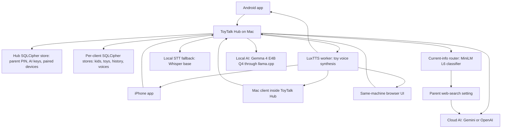

# ToyTalk

**A local-first pretend-play voice companion for kids’ plush toys.**

ToyTalk lets a parent create kid profiles, create toy buddies, upload a short
sample of how each toy should sound, approve the cloned voice, and then let a
child talk to that toy through Android, iPhone, the Mac experience inside
ToyTalk Hub, or the same-machine browser UI.

ToyTalk is built around **ToyTalk Hub**, a local backend that runs first on
macOS. The Hub owns encrypted storage, kid and toy data, parent settings,
guardrails, AI routing, voice cloning, conversation history, and all durable
family data. Phone, Mac, and browser clients are intentionally thin UI shells.

> Current status: open-source prototype / product-engineering project. It is
> usable from local release artifacts, but it is not App Store / Play Store
> production-distribution ready yet.

## Quick start for non-technical users

If you just want to try ToyTalk, use the release artifacts instead of cloning
and building the repo.

1. Open the current release:
   [ToyTalk v2 release](https://github.com/palwe-prafulla/plushpal/releases/tag/v2)
2. Download the macOS DMG and Android APK from the release assets.
3. Install and open **ToyTalk Hub** on the Mac.
4. Wait for Hub setup to finish. First launch may download voice/AI runtimes.
5. In Hub, set the parent PIN and choose one AI mode:
   - **Local AI** for maximum privacy.
   - **Cloud AI** for Gemini/OpenAI responses using your own API key.
6. Install the Android APK, open ToyTalk on the phone, and pair it by scanning
   the QR code shown by Hub.
7. Add a kid, add a toy buddy, upload a voice sample, preview the voice, approve
   it, and start playtime.

The macOS artifact is intentionally lightweight. Heavy runtimes and models are
downloaded by ToyTalk Hub during setup and stored outside this git repository.

Release assets currently include:

- macOS ToyTalk Hub DMG, with the Mac ToyTalk client embedded inside Hub;
- Android debug APK for local sideload testing;
- iPhone simulator archive;
- unsigned iPhone device archive for developer signing;
- release notes and SHA-256 checksums.

## Current UI note

ToyTalk now supports Light, Dark, and System theme modes across the Hub/client
UI. Older reference screenshots are kept under
[`docs/assets/screenshots`](docs/assets/screenshots), but the README does not
render them directly because those captures may lag behind the current themed
UI. Refresh them before using screenshots in marketing or a release page.

## What ToyTalk does

- Creates up to four kid profiles with name, birthdate, and photo.
- Creates toy-buddy characters per kid, each with photo, personality, parent
  guidance, persona age, and a separate approved voice profile.
- Uploads M4A/WAV/MP3/AAC/OGG/WebM voice samples.
- Creates a local LuxTTS voice profile and requires parent approval before use.
- Supports voice-first child input on native clients, with typing as fallback.
- Offers two parent-facing AI modes: Local AI and Cloud AI.
- Redacts/pseudonymizes child information before Cloud AI calls.
- Runs a small local router on every child question to detect current/live
  questions, so ToyTalk avoids stale answers for things like weather today,
  sports scores, or current office holders.
- Lets parents turn Cloud AI web search on/off. Search is used only when the
  local router marks a turn as needing current/live information.
- Keeps Hub-owned encrypted conversation history scoped by kid and toy buddy.
- Synthesizes every spoken response locally through LuxTTS in the approved toy
  voice.

## Exact model and runtime stack

The current v2 implementation is intentionally specific. These are the defaults
used by the code today:

| Capability | Current default |
|---|---|
| Toy voice cloning / TTS | `YatharthS/LuxTTS` |
| Voice synthesis settings | `num_steps=4`, `speed=0.88`, `seed=11`, approved reference up to 180 seconds |
| Local AI model | Google Gemma 4 E4B Q4 GGUF, code id `gemma-4-e4b-q4` |
| Local AI runtime | `llama.cpp` launched by ToyTalk Hub |
| Hub STT fallback | `openai/whisper-base` through the Hub-managed Python/Transformers runtime |
| Current/live question router | `sentence-transformers/all-MiniLM-L6-v2` plus a tiny ToyTalk classifier |
| Cloud AI default | Gemini `gemini-3.5-flash` |
| Cloud AI fallback candidates | Gemini `gemini-3.1-flash-lite`, `gemini-flash-latest`, `gemini-2.5-flash-lite` |
| OpenAI default | `gpt-4.1-mini` |
| Database | SQLCipher through Rust `rusqlite` |
| Hub backend | Rust, Axum, Tokio |
| Shared client UI | Flutter / Dart |
| macOS Hub shell | Swift AppKit |

The generated apps do **not** bundle LuxTTS weights, Whisper weights, Gemma
GGUF files, or Python virtual environments. Hub setup downloads/prepares those
assets into user-local support/cache folders as needed.

## Architecture at a glance

ToyTalk follows a local-Hub architecture. The Mac running ToyTalk Hub behaves
like a private home backend; clients are UI surfaces.


```mermaid
flowchart TB
    Android["Android app"]
    IPhone["iPhone app"]
    MacClient["Mac client inside ToyTalk Hub"]
    Browser["Same-machine browser UI"]

    Android --> Hub["ToyTalk Hub on Mac"]
    IPhone --> Hub
    MacClient --> Hub
    Browser --> Hub

    Hub --> HubStore["Hub SQLCipher store: parent PIN, AI keys, paired devices"]
    Hub --> ClientStores["Per-client SQLCipher stores: kids, toys, history, voices"]
    Hub --> Voice["LuxTTS worker: toy voice synthesis"]
    Hub --> STT["Local STT fallback: Whisper base"]
    Hub --> Router["Current-info router: MiniLM L6 classifier"]
    Hub --> LocalAI["Local AI: Gemma 4 E4B Q4 through llama.cpp"]
    Hub --> CloudAI["Cloud AI: Gemini or OpenAI"]

    Router --> SearchPolicy["Parent web-search setting"]
    SearchPolicy --> CloudAI
    Voice --> Android
    Voice --> IPhone
    Voice --> MacClient
    Voice --> Browser
```

Important boundaries:

- Hub owns durable family data, encrypted storage, API keys, guardrails,
  redaction, local/cloud AI routing, voice profiles, and conversation history.
- Android/iPhone/Mac/browser clients store only minimal shell state: stable
  client identity, pairing/session information, theme/UI preferences, OS
  permissions, and temporary media-picker data.
- Local browser is supported only on the same machine running Hub.
- External browser clients are intentionally out of scope for the MVP.
- QR pairing is only for external native clients such as Android/iPhone. The
  local Mac client and local browser attach directly to the local Hub.

## Runtime modes

ToyTalk Hub has only two normal parent-facing modes.

| Mode | What runs locally | What may leave the home network | Typical use |
|---|---|---|---|
| Local AI | SQLCipher storage, STT fallback, Gemma 4 E4B Q4, LuxTTS | Nothing after model/setup downloads | Maximum privacy and offline-style play |
| Cloud AI | SQLCipher storage, STT fallback, redaction, guardrails, LuxTTS | Redacted text prompt to Gemini/OpenAI; optional provider-native search | Better answer quality and lower local compute |

In both modes, raw voice samples and generated toy audio stay local. Voice
samples are used to create approved local voice references; they are not sent to
Gemini or OpenAI.

## Repository layout

```text
ToyTalk/
  apps/
    android/flutter_app/          Shared Flutter client for Android, iPhone, browser
      lib/src/app.dart            Main UI and state orchestration
      lib/src/backend/            Backend abstraction and platform clients
      android/.../MainActivity.kt Android native bridge
      ios/Runner/...swift         iOS native bridge
      web/plushpal_backend.js     Local browser bridge
    macos/
      station_app/AppShell.swift  Native ToyTalk Hub setup UI
      client_app/AppShell.swift   Embedded Mac ToyTalk client shell
    station/macstation_host/      Rust ToyTalk Hub backend; legacy folder name
    web/                          Web ownership notes
  crates/                         Reusable Rust crates
  native/                         C/C++/C ABI headers and adapters
  tools/voice/                    LuxTTS and voice experiment scripts
  tools/stt/                      STT fallback scripts
  packaging/                      macOS, Android, iOS, release helpers
  qa/                             Unit, smoke, and E2E automation
  docs/                           Architecture, product, release docs
```

See the detailed map in
[`docs/architecture/CODEBASE_DIRECTORY_GUIDE.md`](docs/architecture/CODEBASE_DIRECTORY_GUIDE.md).

Private/generated folders such as local voice-sample folders, model downloads,
virtual environments, QA results, and packaged build outputs are ignored. Public
build scripts write generated artifacts outside the checkout under
`~/Downloads/ToyTalk`.

## Developer setup from source

Use this path if you want to build, debug, or modify ToyTalk.

### Prerequisites

- macOS on Apple Silicon for the current LuxTTS path.
- Git.
- Rust via `rustup`; this repo pins Rust 1.86.0 in
  [`rust-toolchain.toml`](rust-toolchain.toml).
- Flutter stable; the recent verified local version is Flutter 3.44.2 /
  Dart 3.12.2.
- Python 3.11+ or 3.12.
- Xcode Command Line Tools.
- Android Studio, Android SDK/NDK, and accepted Android licenses for Android.
- Full Xcode, CocoaPods, simulator runtime, and iOS signing/provisioning for
  iPhone development.

### Fresh clone

```sh
git clone <repo-url> ToyTalk
cd ToyTalk
git submodule update --init --recursive
make doctor
```

### Build local release-style artifacts

```sh
make public-artifacts
make release-bundle
```

Outputs are written outside the source checkout:

```text
~/Downloads/ToyTalk/artifacts
~/Downloads/ToyTalk/release
```

Expected artifacts, depending on installed platform toolchains:

```text
~/Downloads/ToyTalk/artifacts/macos/ToyTalk Hub.app
~/Downloads/ToyTalk/artifacts/macos/ToyTalk-v2-macos.zip
~/Downloads/ToyTalk/artifacts/macos/ToyTalk-v2-macos.dmg
~/Downloads/ToyTalk/artifacts/android/ToyTalk-debug.apk
~/Downloads/ToyTalk/artifacts/ios/ToyTalk-iPhoneSimulator.app
~/Downloads/ToyTalk/artifacts/ios/ToyTalk-iPhoneOS-unsigned.app
```

### Open Hub from a local build

```sh
open "$HOME/Downloads/ToyTalk/artifacts/macos/ToyTalk Hub.app"
```

From Hub you can:

- use ToyTalk on the same Mac;
- open the same-machine browser UI;
- show an Android/iPhone QR pairing code;
- choose Local AI or Cloud AI;
- install the recommended local model;
- configure Gemini/OpenAI keys for Cloud AI.

### Platform-specific build shortcuts

```sh
make package-macos     # macOS ToyTalk Hub only
make android-apk       # Android debug APK
make ios-simulator     # iPhone simulator app
make ios-device        # unsigned iPhone device build
make build-all         # Hub + Android + iPhone simulator + unsigned iPhone device
```

Low-level Android output:

```text
apps/android/flutter_app/build/app/outputs/flutter-apk/app-debug.apk
```

Install on a connected Android device:

```sh
adb install -r apps/android/flutter_app/build/app/outputs/flutter-apk/app-debug.apk
```

Physical iPhone install requires Apple signing/provisioning in Xcode.

### Developer demo mode

For a lightweight flow check without LuxTTS voice cloning or a cloud API key:

```sh
make run-demo
```

Demo mode uses deterministic demo reasoning and a synthetic voice engine. It is
useful for UI/API smoke testing, but it does not represent real toy-voice
quality.

## Testing and quality gates

Common checks:

```sh
make public-repo-check
make format lint flutter test-product-layout
make test
```

Release-style local check:

```sh
make public-artifacts
make release-bundle
make verify-release-local
```

Product-level smoke/E2E scripts live under [`qa/automation`](qa/automation):

```sh
qa/automation/run_local_quality_gate.sh
qa/automation/android_device_smoke.sh
qa/automation/android_station_pairing_smoke.sh
qa/automation/ios_simulator_smoke.sh
qa/automation/macstation_api_smoke.py
qa/automation/macstation_live_reasoning_smoke.mjs
```

Full LuxTTS E2E with private samples is intentionally opt-in and should use
samples outside the repo:

```sh
qa/automation/macstation_api_smoke.py \
  --voice-engine luxtts \
  --synthesize \
  --sample Buddy="$HOME/Downloads/ToyTalk/private/audio-samples/Buddy.m4a"
```

Generated evidence is written under `~/Downloads/ToyTalk/test-results` by
default.

## Troubleshooting and logs

ToyTalk Hub writes local logs under:

```text
~/Library/Application Support/ToyTalk/logs
```

Useful technical checks:

```sh
tail -100 "$HOME/Library/Application Support/ToyTalk/logs/host.log"
grep "ToyTalk latency" "$HOME/Library/Application Support/ToyTalk/logs/host.log" | tail -30
grep "ToyTalk ai_response" "$HOME/Library/Application Support/ToyTalk/logs/host.log" | tail -30
grep "phase=hub_web_search" "$HOME/Library/Application Support/ToyTalk/logs/host.log" | tail -30
grep "cloud provider failure" "$HOME/Library/Application Support/ToyTalk/logs/host.log" | tail -30
```

`ToyTalk ai_response` lines record the Local AI/Gemini/OpenAI response that was
actually used, tagged with mode, provider, model, and request id. Logs are
local plain files on the Hub Mac, so treat them as private family/debug data
before sharing. API keys and SQLCipher keys must never appear in logs.

For parent-friendly recovery steps, see
[`docs/product/USER_GUIDE.md`](docs/product/USER_GUIDE.md). For deeper technical
triage, see
[`docs/product/TROUBLESHOOTING.md`](docs/product/TROUBLESHOOTING.md).

## Documentation map

- [`docs/architecture/SYSTEM_DESIGN.md`](docs/architecture/SYSTEM_DESIGN.md) —
  full system design and architecture.
- [`docs/architecture/HUB_CLIENT_ARCHITECTURE.md`](docs/architecture/HUB_CLIENT_ARCHITECTURE.md) —
  Hub/client ownership model.
- [`docs/architecture/CODEBASE_DIRECTORY_GUIDE.md`](docs/architecture/CODEBASE_DIRECTORY_GUIDE.md) —
  directory-level code map.
- [`docs/product/USER_GUIDE.md`](docs/product/USER_GUIDE.md) — parent/user guide.
- [`docs/product/PRIVACY_AND_SECURITY.md`](docs/product/PRIVACY_AND_SECURITY.md) —
  privacy and security model.
- [`docs/product/KNOWN_LIMITATIONS.md`](docs/product/KNOWN_LIMITATIONS.md) —
  current limitations.
- [`docs/product/TROUBLESHOOTING.md`](docs/product/TROUBLESHOOTING.md) —
  technical debug guide.
- [`docs/release/QA_TEST_PLAN_AND_EXECUTION_2026-06-25.md`](docs/release/QA_TEST_PLAN_AND_EXECUTION_2026-06-25.md) —
  QA plan and execution notes.
- [`docs/release/REQUIREMENTS_TRACEABILITY.md`](docs/release/REQUIREMENTS_TRACEABILITY.md) —
  requirements-to-evidence traceability.
- [`docs/release/RELEASE_CHECKLIST.md`](docs/release/RELEASE_CHECKLIST.md) —
  release checklist.
- [`THIRD_PARTY.md`](THIRD_PARTY.md) and
  [`docs/release/THIRD_PARTY_LICENSES.md`](docs/release/THIRD_PARTY_LICENSES.md) —
  third-party components and model notes.

## Known limitations

- Physical iPhone testing still needs Apple signing/provisioning.
- macOS DMG and mobile artifacts are local/dev artifacts, not notarized or
  store-distributed builds.
- Browser/Mac mic capture depends on WebKit/browser audio APIs; typed chat is
  the fallback when mic capture is blocked.
- LuxTTS quality is good for the current toy samples, but voice latency remains
  the biggest product-experience challenge.
- The Hub Mac must stay awake and reachable while phone clients are using toy
  voices.
- Windows/Linux Hub launchers are future work.
- No production account sync or cloud backup yet. Hub-owned encrypted backup
  export/import exists for local use.
- App Store / Play Store privacy labels, notarization, signing, and managed
  distribution are not done.

## Release history

- `v0` — first development artifact release.
- `v1` — intermediate Hub architecture checkpoint.
- `v2` — current lightweight ToyTalk Hub architecture.

## License

ToyTalk is released under the [MIT License](LICENSE).
