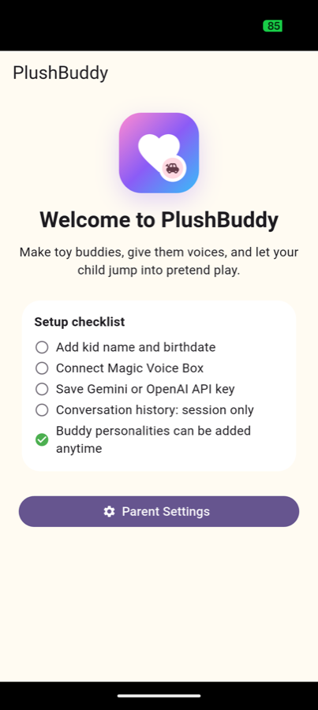
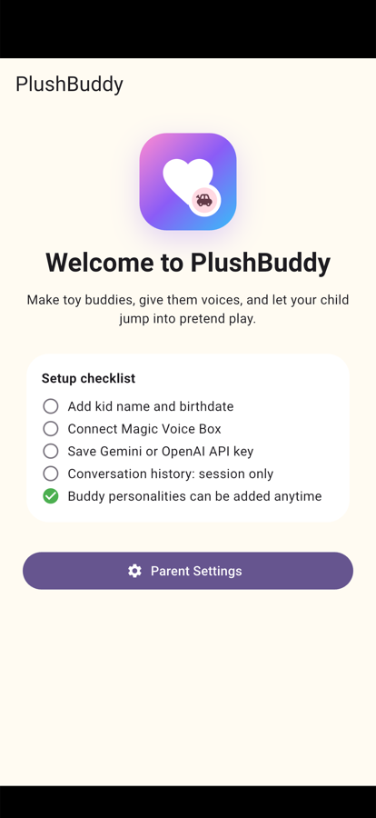
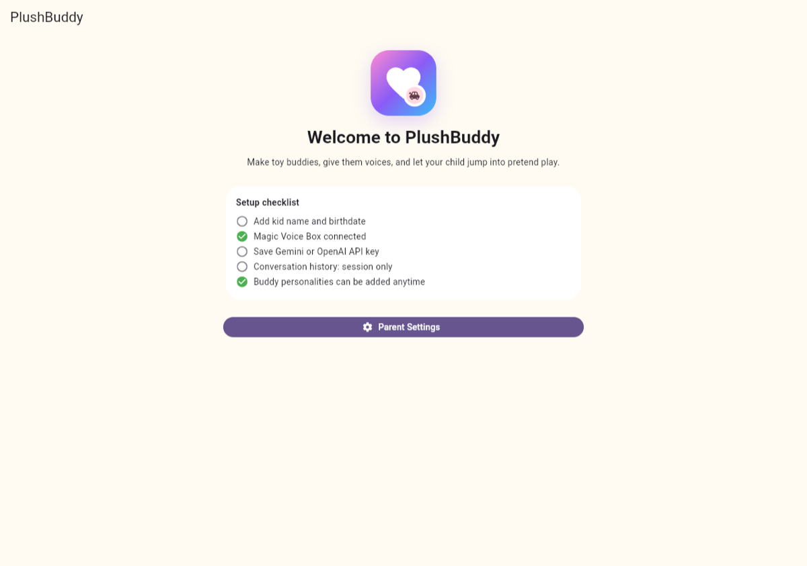
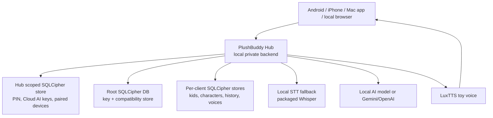

# PlushBuddy

**A local-first pretend-play voice companion for kids’ plush toys.**

PlushBuddy lets a parent create kid profiles, create toy buddies, upload a short
sample of how each toy should sound, approve the cloned voice, and then let a
child talk to that toy through an Android app, iPhone app, Mac app, or local
browser UI.

The current architecture centers on **PlushBuddy Hub**: a local private backend
that runs first on macOS. The Hub owns encrypted storage, child-safety
guardrails, reasoning orchestration, provider API keys, kid/character data,
conversation history, and LuxTTS voice synthesis. Native clients are thin UI
clients for mic capture, local STT when available, and playback.

> This is a prototype/product-engineering project, not a hosted service. It is
> designed to be cloned, built locally, studied, and extended.

## Screenshots

**Android app** — parent setup and child-mode entry on a real Android device.

<p>
  
</p>

**iPhone simulator** — same shared Flutter client running on iOS.

<p>
  
</p>

**Browser client** — local web client opened from PlushBuddy Hub.

<p>
  
</p>

**Mac app** — native macOS shell around the same desktop client experience.

<p>
  
</p>

## What it does

- Creates up to four kid profiles with names, birthdates, and photos.
- Creates toy-buddy characters per kid, each with photo, personality, guidance,
  persona age, and a separate voice profile.
- Uploads M4A/WAV/MP3/AAC/OGG/WebM voice samples and creates a local voice
  profile through LuxTTS.
- Requires parent approval before a voice can be used in conversation.
- Supports voice-first child input on native clients, with typing as fallback.
- Offers two Hub modes: Local AI or Cloud AI.
- Redacts/pseudonymizes kid information before cloud reasoning in cloud mode.
- Synthesizes the response locally through LuxTTS in the selected toy voice.
- Keeps conversation history scoped by kid and character.

## Architecture at a glance

PlushBuddy uses a local-Hub architecture:

- **PlushBuddy Hub**: the local backend. It owns SQLCipher encrypted storage,
  runtime mode, provider keys, kid/character data, conversation history,
  guardrails, local/cloud reasoning, packaged local STT fallback, and LuxTTS.
- **Android app**: external voice-first native client paired to the Hub.
- **iPhone app**: external voice-first native client paired to the Hub.
- **Mac app**: native client that can run on the Hub Mac or another Mac.
- **Local browser**: same-machine browser UI for the computer running the Hub.
  Remote browser clients are not supported for now.

Android/iPhone/Mac/browser clients now route parent setup, kids, characters,
provider keys, history, voice enrollment, and conversation turns through the
Hub. External apps only keep the minimum local shell state needed to operate:
stable client identity, pairing/session information, theme/UI preferences, OS
permission state, and temporary mic/file-picker data. They do not own durable
family data, API keys, voice profiles, or conversation history.

The Hub also has its own stable `hub-*` client identity. Hub admin data
including parent PIN, Cloud AI provider keys, active provider, and paired-device
revocation lives in that Hub-scoped encrypted store. During pairing/bootstrap,
the Hub returns that Hub ID to the client. After that, every private persisted
client request sends both `X-PlushBuddy-Client-Id` and
`X-PlushBuddy-Hub-Id`: client-owned data is isolated by stable device identity,
while Hub-owned checks such as parent PIN and Cloud AI settings are routed to
the Hub store explicitly rather than by IP address or hidden global fallback.


```mermaid
flowchart TB
    Clients["Android / iPhone / Mac app / local browser"] --> Hub["PlushBuddy Hub<br/>local private backend"]
    Hub --> HubDB["Hub scoped SQLCipher store<br/>PIN, Cloud AI keys, paired devices"]
    Hub --> Registry["Root SQLCipher DB<br/>key + compatibility store"]
    Hub --> ClientDB["Per-client SQLCipher stores<br/>kids, characters, history, voices"]
    Hub --> STT["Local STT fallback<br/>packaged Whisper"]
    Hub --> AI["Local AI model or Gemini/OpenAI"]
    Hub --> TTS["LuxTTS toy voice"]
    TTS --> Clients
```

### Hub setup modes

| Mode | What runs locally | What may leave the home network | Best for |
|---|---|---|---|
| Local AI | STT fallback, AI, LuxTTS, SQLCipher storage | Nothing after model setup/update checks | Maximum privacy |
| Cloud AI | STT fallback, redaction, guardrails, LuxTTS, SQLCipher storage | Redacted text prompt to Gemini/OpenAI | Better answer quality / lower local compute |

In both modes, raw voice samples and generated toy voice audio stay local.

## Download the current prerelease

Large app binaries are not committed into the git repository. The source repo
stays lightweight, while downloadable dev artifacts are published on GitHub
Releases:

**[Download PlushBuddy v0.1.0-dev.1 artifacts](https://github.com/palwe-prafulla/plushpal/releases/tag/v0.1.0-dev.1)**

That release includes:

- macOS Hub + Mac client DMG, split into `.part-aa`, `.part-ab`, ... files
  because the DMG is large;
- Android debug APK;
- iPhone simulator app archive;
- unsigned iPhone device app archive;
- release notes and SHA-256 checksums.

To reassemble the macOS DMG after downloading all DMG parts:

```sh
cat PlushBuddy-*.dmg.part-* > PlushBuddy-0.1.0-macos.dmg
```

## Quick start

From a fresh clone on macOS:

```sh
make doctor
make public-artifacts
make release-bundle
```

Artifacts are written outside the source checkout under:

```text
~/Downloads/PlushPal/artifacts
~/Downloads/PlushPal/release
```

To publish a prepared release bundle to GitHub after creating a tag/versioned
bundle, use:

```sh
make publish-release TAG=v0.1.0 RELEASE_DIR=~/Downloads/PlushPal/release/v0.1.0
```

The publisher reads `GITHUB_TOKEN` or the macOS Keychain service
`codex.github.token`.

Open:

```text
~/Downloads/PlushPal/artifacts/macos/PlushBuddy Hub.app
```

Then use Hub to open the Mac app, open the local browser client, or
scan the QR code from Android/iPhone.

For a lightweight developer demo without LuxTTS voice cloning or a cloud API
key, run:

```sh
make run-demo
```

This starts the current Hub runtime in `PLUSHPAL_RUNTIME_MODE=demo`, with deterministic demo
reasoning and a synthetic voice engine. It validates the app flow, but it does
not represent the real cloned toy-voice quality. Demo mode is a Hub runtime;
external apps still use Hub APIs and do not create their own demo family store.

## Documentation map

Start here:

- [Detailed system design and architecture](docs/architecture/SYSTEM_DESIGN.md)
- [Codebase directory guide](docs/architecture/CODEBASE_DIRECTORY_GUIDE.md)
- [PlushBuddy Hub client architecture](docs/architecture/HUB_CLIENT_ARCHITECTURE.md)
- [Documentation publication policy](docs/PUBLICATION_POLICY.md)
- [Production hardening plan](docs/implementation/PRODUCTION_HARDENING_PLAN.md)
- [QA test plan and latest execution report](docs/release/QA_TEST_PLAN_AND_EXECUTION_2026-06-25.md)
- [Privacy and security model](docs/product/PRIVACY_AND_SECURITY.md)
- [Known limitations](docs/product/KNOWN_LIMITATIONS.md)
- [Requirements traceability](docs/release/REQUIREMENTS_TRACEABILITY.md)
- [Release checklist](docs/release/RELEASE_CHECKLIST.md)
- [GitHub repository settings](docs/release/GITHUB_REPOSITORY_SETTINGS.md)
- [Contributing guide](CONTRIBUTING.md)
- [Security policy](SECURITY.md)
- [Third-party components](THIRD_PARTY.md)

## License

PlushBuddy is released under the [MIT License](LICENSE).

## Current prerelease and Hub architecture

The current `v0.1.0-dev.1` prerelease is buildable and demonstrates the product
flow with Android, iPhone simulator, Mac client, local browser, and the macOS
PlushBuddy Hub runtime.

The implementation has moved to this stricter backend model:

- Hub owns durable data, encrypted storage, provider keys, guardrails,
  redaction, local/cloud reasoning, voice profiles, and conversation history.
- Android/iPhone/Mac/future Windows clients are thin voice-first UI clients.
- Clients store only stable pairing/client identity and session data.
- Local browser is supported only on the same machine running the Hub.
- Remote browser clients are intentionally out of scope.

## Target runtime flow

### Hub startup

1. Parent opens `PlushBuddy Hub`.
2. Hub prevents system sleep while active.
3. Hub opens/creates the SQLCipher database.
4. Hub shows exactly two setup modes:
   - Local AI mode;
   - Cloud AI.
5. Hub verifies required runtimes for the selected mode.
6. Parent opens local browser/Mac client or displays QR pairing for native
   external clients.

### Character voice creation

1. Parent creates kid and character through any paired client.
2. Hub stores profiles in SQLCipher.
3. Parent uploads a voice sample.
4. Hub validates, converts, preprocesses, and stores the processed reference
   encrypted.
5. Parent previews and approves the LuxTTS voice before child use.

### Child conversation

1. Child speaks to a native client.
2. Native Android/iPhone clients use verified on-device STT if available.
3. If native STT is unavailable or fails, Android/iPhone record a bounded local
   WAV and send it to the paired Hub’s packaged local Whisper STT endpoint.
4. Local browser/Mac WebKit clients use bounded microphone capture and the same
   Hub STT endpoint when browser mic APIs are available.
5. Client sends transcript to Hub.
6. Hub loads kid/character/history/settings from SQLCipher.
7. Hub applies guardrails and redaction.
8. Hub uses either local AI model or Gemini/OpenAI depending on mode.
9. Hub stores the turn.
10. Hub synthesizes the response with LuxTTS.
11. Client plays the generated toy voice.

## Technology stack

| Layer | Technology |
|---|---|
| Shared UI | Flutter / Dart |
| Android native client | Kotlin, verified on-device STT target, bounded WAV fallback capture, WAV playback, file picker, QR pairing |
| iOS native client | Swift, on-device Speech target, bounded WAV fallback capture, AVAudio playback, file picker, QR pairing |
| Mac client | Swift AppKit client shell |
| Local browser | Flutter web served only on the Hub machine, with bounded mic capture to Hub STT when browser APIs allow it |
| Hub launcher | Swift AppKit first; Windows/Linux launchers later |
| Hub backend | Rust, Axum, Tokio |
| Hub database | SQLCipher via Rust `rusqlite` |
| Hub STT fallback | Lazy setup using the Hub-managed Python/LuxTTS runtime plus `openai/whisper-base`; `whisper.cpp` is the future lean-runtime target |
| Local AI model | `llama.cpp` + signed Google Gemma GGUF model tier by memory |
| Voice model | LuxTTS through `tools/voice/luxtts_worker.py` |
| Cloud AI mode | Gemini/OpenAI called from Hub after redaction |
| Packaging | Makefile, Cargo, Flutter, Gradle, Xcode, shell scripts |

## Repository structure

```text
PlushPal/
  apps/
    android/flutter_app/          Shared Flutter app for Android, iPhone, browser
      lib/src/app.dart            Main UI and state orchestration
      lib/src/backend/            Backend abstraction and platform clients
      android/.../MainActivity.kt Android native bridge
      ios/Runner/...swift         iOS native bridge
      web/plushpal_backend.js     Local browser bridge
    macos/
      station_app/AppShell.swift  Native PlushBuddy Hub setup UI
      client_app/AppShell.swift   Native PlushBuddy Mac client shell
    station/macstation_host/      Rust Hub backend; still uses legacy path name
    web/                          Web ownership notes
  crates/                         Reusable Rust crates
  native/                         C/C++/C ABI headers and adapters
  tools/voice/                    LuxTTS and voice experiment scripts
  third_party/                    Small pinned source deps only; model runtimes download outside repo
  packaging/                      macOS, Android, Windows packaging helpers
  docs/                           Current architecture, release, product docs
```

See [CODEBASE_DIRECTORY_GUIDE.md](docs/architecture/CODEBASE_DIRECTORY_GUIDE.md) for the detailed code map.

Local-only/private folders such as `audio-samples/`, old `test-artifacts/`,
old `qa/results/`, model downloads, virtual environments, and packaged build
outputs are intentionally ignored. Current build/test commands write artifacts
outside the repo under `~/Downloads/PlushPal` by default.

## Prerequisites

### Required for most development

- macOS on Apple Silicon for the current LuxTTS path.
- Git.
- Rust via `rustup`; this repo pins Rust 1.86.0 in `rust-toolchain.toml`.
- Flutter stable; current verified version is Flutter 3.44.2 / Dart 3.12.2.
- Python 3.11+ or 3.12 for voice runtimes.
- Xcode Command Line Tools.

### Android

- Android Studio.
- Android SDK and NDK.
- Accepted Android licenses:

```sh
flutter doctor --android-licenses
```

### iPhone

- Full Xcode, not Command Line Tools only.
- CocoaPods.
- iOS simulator runtime.
- Rust iOS targets:

```sh
rustup target add aarch64-apple-ios-sim x86_64-apple-ios aarch64-apple-ios
```

Verified local environment as of June 24, 2026:

- Xcode 26.5
- CocoaPods 1.16.2
- iOS 26.5 simulator runtime
- Flutter 3.44.2

Physical iPhone install requires Apple signing/provisioning.

## First-time setup from a fresh clone

```sh
git clone <repo-url> PlushPal
cd PlushPal
git submodule update --init --recursive
flutter doctor -v
```

Install voice runtime for the Hub path:

```sh
make setup-luxtts-voice
```

Optional fallback/research voice runtime:

```sh
make setup-chatterbox-voice
```

## Build commands

### Validate Flutter app

```sh
cd apps/android/flutter_app
flutter analyze
flutter test
```

### Build Android APK for local development

```sh
make android-apk
```

Output from this low-level development command:

```text
apps/android/flutter_app/build/app/outputs/flutter-apk/app-debug.apk
```

Install on connected Android device:

```sh
adb install -r apps/android/flutter_app/build/app/outputs/flutter-apk/app-debug.apk
```

### Build iPhone simulator app for local development

```sh
make ios-simulator
```

Output from this low-level development command:

```text
apps/android/flutter_app/build/ios/iphonesimulator/Runner.app
```

### Build unsigned iPhone device app for local development

```sh
make ios-device
```

Output from this low-level development command:

```text
apps/android/flutter_app/build/ios/iphoneos/Runner.app
```

This verifies compilation for device architecture. Installing on a real iPhone requires signing in Xcode.

### Build public local artifacts

For a clean public-repo style build, use:

```sh
make public-artifacts
```

This command builds from an external workspace under `~/Downloads/PlushPal/build`
and writes artifacts under `~/Downloads/PlushPal/artifacts`, so generated files do
not dirty the source checkout. The generated apps stay lightweight: LuxTTS
source/dependencies/model cache and Local AI GGUF models are downloaded later by
PlushBuddy Hub setup into the user’s application-support/cache directories.

Expected artifacts, depending on installed platform toolchains:

```text
~/Downloads/PlushPal/artifacts/macos/PlushBuddy Hub.app
~/Downloads/PlushPal/artifacts/macos/PlushBuddy.app
~/Downloads/PlushPal/artifacts/macos/PlushBuddy-0.1.0-macos.zip
~/Downloads/PlushPal/artifacts/macos/PlushBuddy-0.1.0-macos.dmg
~/Downloads/PlushPal/artifacts/android/PlushBuddy-debug.apk
~/Downloads/PlushPal/artifacts/ios/PlushBuddy-iPhoneSimulator.app
~/Downloads/PlushPal/artifacts/ios/PlushBuddy-iPhoneOS-unsigned.app
```

### Build Hub and Mac client only

```sh
make package-macos
```

Outputs:

```text
~/Downloads/PlushPal/artifacts/macos/PlushBuddy Hub.app
~/Downloads/PlushPal/artifacts/macos/PlushBuddy.app
~/Downloads/PlushPal/artifacts/macos/PlushBuddy-0.1.0-macos.zip
~/Downloads/PlushPal/artifacts/macos/PlushBuddy-0.1.0-macos.dmg
```

### Build all local MVP artifacts

```sh
make build-all
```

This builds:

- Hub app;
- Mac client app;
- Android debug APK;
- iPhone simulator app;
- unsigned iPhone device app.

## How to run the app

### Start PlushBuddy Hub

```sh
open "$HOME/Downloads/PlushPal/artifacts/macos/PlushBuddy Hub.app"
```

Wait until health checks are green. Hub should show:

- app storage ready;
- voice engine ready;
- local service healthy;
- browser/Mac client local attach ready;
- Android/iPhone/Mac external pairing QR ready.

Local clients on the same Mac do not need QR scanning. Click **Open PlushBuddy
in browser** or **Open PlushBuddy Mac app** from Hub and the client attaches in
the background. QR pairing is for external native clients.

### Use Android

1. Install the APK.
2. Open PlushBuddy on Android.
3. In Hub, choose the pairing QR option.
4. Scan the QR in the Android app.
5. In Hub:
   - set the parent PIN;
   - choose Local AI or Cloud AI mode;
   - configure Gemini/OpenAI if using Cloud AI;
   - install the recommended local model if using Local AI.
6. In Android settings:
   - create kid profile;
   - create character;
   - upload character photo and voice sample;
   - preview and approve the voice.
7. Enter child mode and start talking.

### Use iPhone

The iPhone app has the same architecture as Android, but physical install requires Xcode signing.

Development flow:

```sh
make ios-simulator
open -a Simulator
```

For physical iPhone:

1. Open `apps/android/flutter_app/ios/Runner.xcodeproj` or workspace in Xcode.
2. Set your Apple development team.
3. Connect and trust the iPhone.
4. Build/run from Xcode or Flutter.
5. Test QR pairing, microphone permission, local-network permission, file picking, voice preview, approval, and child conversation.

### Use browser

1. Start Hub.
2. Click **Open PlushBuddy in browser**.
3. The browser attaches to the local Hub session automatically; no QR scan is needed.
4. Use it only on the same machine running Hub.

### Use Mac client

1. Start Hub.
2. Click **Open PlushBuddy Mac app**.
3. The Mac client opens the Hub-backed client UI and attaches automatically when local.

## Voice model notes

The current best local voice path is LuxTTS with:

```text
num_steps = 8
speed     = 0.88
seed      = 11
reference = full uploaded reference, up to 180 seconds
```

Hub starts a persistent LuxTTS worker so the model stays loaded between requests. It also caches encoded voice prompt/reference state by audio hash where supported, reducing repeated work without changing quality settings.

Raw uploaded samples are transient. Hub persists only the encrypted processed reference artifact needed for future synthesis.

Chatterbox remains wired as a fallback/smoke-test path. OpenVoice, GPT-SoVITS, F5/TADA, and related scripts remain research/bakeoff paths, not the current product voice runtime.

## Runtime mode notes

Hub setup should offer only two parent-facing modes:

- **Local AI**: verified client STT or Hub STT fallback, local AI model,
  LuxTTS, and SQLCipher storage.
- **Cloud AI**: verified client STT or Hub STT fallback, Hub redaction and
  guardrails, Gemini/OpenAI text reasoning, LuxTTS, and SQLCipher storage.

## Security and privacy model

- Parent PIN gates parent settings.
- Hub stores durable app state in SQLCipher.
- Clients store only stable Hub pairing/client identity and session data.
- Local browser/Mac attach and Android/iPhone/Mac QR pairing both use a bootstrap token exchanged for a Hub session.
- Hub validates Host/Origin and bounds request sizes.
- Voice samples are not sent to Cloud AI providers.
- Cloud AI mode receives redacted text plus age/persona/safety context.

## Test commands

```sh
qa/automation/run_local_quality_gate.sh
make public-artifacts
```

`qa/automation/run_local_quality_gate.sh` runs from an external test workspace
and writes logs under `~/Downloads/PlushPal/test-results`.

Latest local verification, June 25, 2026:

- public artifact build passed with Hub, Mac client, Android APK,
  iPhone simulator app, and unsigned iPhone device app under
  `~/Downloads/PlushPal/artifacts`;
- local quality gate passed: Rust workspace tests, Flutter analysis/tests, web
  Node tests, and product layout check;
- Hub API smoke passed;
- full LuxTTS E2E passed with Sheru/Jenna/Buddy M4A samples: enroll, approve,
  verify unique profile IDs, and synthesize WAV;
- packaged Hub launched and reached readiness;
- browser client rendered through packaged Hub;
- packaged Mac client attached to packaged Hub;
- Android real-device install/launch and Hub pairing passed on a connected
  Pixel 10 Pro;
- iPhone simulator install/launch passed.

Latest local verification, July 5, 2026:

- Hub was repackaged and launched in Cloud AI mode;
- Hub health reached ready for local service, LuxTTS voice engine, STT,
  conversation engine, and browser UI;
- Gemini key stored in Hub SQLCipher was detected as configured;
- Android APK was rebuilt/reinstalled on Pixel 10 Pro;
- Android child-mode typed chat reached Hub/Gemini and rendered a child-safe
  Teddy response.

See the full platform-by-platform QA matrix in [docs/release/QA_TEST_PLAN_AND_EXECUTION_2026-06-25.md](docs/release/QA_TEST_PLAN_AND_EXECUTION_2026-06-25.md).

## Product QA automation

Product-level smoke/E2E scripts live under [qa/automation](qa/automation):

```sh
# Local unit/build quality gate
qa/automation/run_local_quality_gate.sh

# Android physical device install/launch smoke
qa/automation/android_device_smoke.sh

# Android debug-build Hub pairing smoke
qa/automation/android_station_pairing_smoke.sh

# iPhone simulator install/launch smoke
qa/automation/ios_simulator_smoke.sh

# Hub API smoke
qa/automation/macstation_api_smoke.py

# Hub M4A enrollment and profile-isolation smoke.
# Use your own private local samples outside the repo.
qa/automation/macstation_api_smoke.py \
  --sample Sheru="$HOME/Downloads/PlushPal/private/audio-samples/Sheru.m4a" \
  --sample Jenna="$HOME/Downloads/PlushPal/private/audio-samples/Jenna.m4a" \
  --sample Buddy="$HOME/Downloads/PlushPal/private/audio-samples/Buddy.m4a"

# Lightweight synthetic voice E2E, no LuxTTS download required.
qa/automation/macstation_api_smoke.py \
  --voice-engine demo \
  --synthesize \
  --sample Sheru="$HOME/Downloads/PlushPal/private/audio-samples/Sheru.m4a" \
  --sample Jenna="$HOME/Downloads/PlushPal/private/audio-samples/Jenna.m4a" \
  --sample Buddy="$HOME/Downloads/PlushPal/private/audio-samples/Buddy.m4a"

# Full local LuxTTS synthesis E2E
qa/automation/macstation_api_smoke.py \
  --voice-engine luxtts \
  --synthesize \
  --sample Sheru="$HOME/Downloads/PlushPal/private/audio-samples/Sheru.m4a" \
  --sample Jenna="$HOME/Downloads/PlushPal/private/audio-samples/Jenna.m4a" \
  --sample Buddy="$HOME/Downloads/PlushPal/private/audio-samples/Buddy.m4a"

# Live Gemini reasoning through current Hub command/WebSocket flow.
# Pass PLUSHPAL_GEMINI_API_KEY in the environment. Do not commit keys.
qa/automation/macstation_live_reasoning_smoke.mjs
```

Generated evidence is written under `~/Downloads/PlushPal/test-results` by default.

## Known limitations

- Physical iPhone testing still needs Apple signing/provisioning.
- Browser/Mac mic capture uses browser/WebKit audio APIs and the Hub STT
  fallback; typed chat remains available when mic capture is blocked.
- LuxTTS quality is good for the current samples, but latency remains a product concern.
- Hub host machine must remain awake/reachable while clients use it.
- Hub owns durable browser/mobile family state. External clients keep only
  stable identity, pairing/session state, UI preferences, and temporary
  permission/media-helper state.
- No production account sync or cloud backup yet. Local encrypted Hub
  backup/export/import is available from Parent Settings.
- Windows is not currently verified.
- App Store / Play Store privacy labels, notarization, and managed distribution are not done.

## Remaining production milestones

The current prerelease can be built locally and publishes downloadable dev
artifacts for Hub/Mac, Android, and iPhone simulator/unsigned device
testing. The items below are still valid because they are product-release
hardening work beyond the current `v0.1.0-dev.1` release:

1. Run physical iPhone E2E with QR pairing, microphone, local-network
   permission, M4A upload, preview, approval, and child conversation.
2. Broaden Mac/WebKit microphone QA and optimize Hub STT runtime packaging.
3. Broaden local/Cloud AI safety regression and model-quality evidence.
4. Polish the two-mode setup screen and local-model install progress UX.
5. Extend visible latency metrics for STT, AI, Hub queue, LuxTTS synthesis,
   WAV transfer, and playback.
6. Add production signing/notarization for Hub and the Mac client.
7. Add managed CI/CD release pipelines for Android, iPhone, and Mac. The repo
   already has local build/release scripts and the current GitHub prerelease
   artifacts; this milestone is about repeatable hosted release automation,
   signing, and store-ready outputs.
