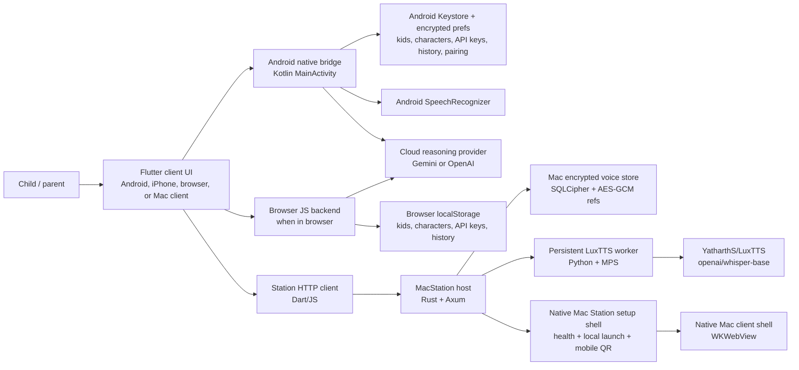
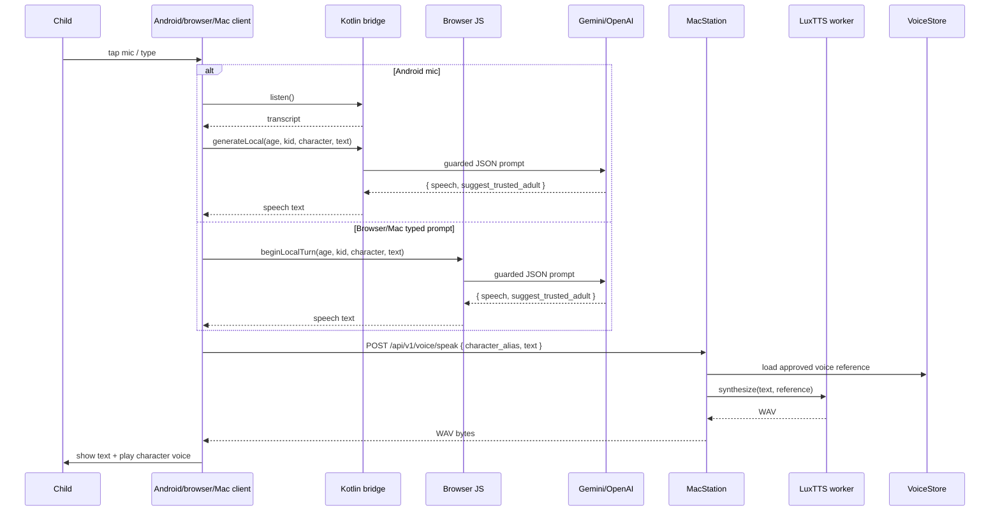
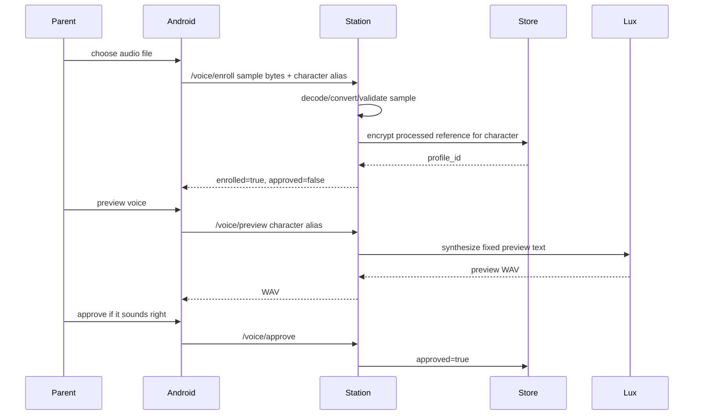

# PlushBuddy Android + MacStation MVP Architecture

Last updated: 2026-06-25

This document describes the current implementation of the PlushBuddy MVP: Android and iPhone pair with a MacStation voice appliance by QR; browser and Mac clients are launched by Station and auto-attach locally without QR scanning. It is intended to be readable both as engineering documentation and as a project showcase.

For the full professional system design with component diagrams, data ownership, runtime flows, security boundaries, model stack, and tradeoffs, see [`SYSTEM_DESIGN.md`](SYSTEM_DESIGN.md). For a system-design-interview version with the 5-minute pitch, likely follow-up questions, tradeoff framing, and whiteboard-friendly diagrams, see [`SYSTEM_DESIGN_INTERVIEW_PREP.md`](SYSTEM_DESIGN_INTERVIEW_PREP.md). For a code-location guide organized by Android app, MacStation, Mac client, browser app, shared Rust crates, voice tools, packaging, and generated folders, see [`CODEBASE_DIRECTORY_GUIDE.md`](CODEBASE_DIRECTORY_GUIDE.md).

## 1. Product summary

PlushBuddy lets a parent create kid profiles and toy-character profiles. A child talks to a selected toy character. Android and iPhone capture speech or typed text; browser and Mac clients currently support typed text. The active client asks a parent-configured cloud reasoning provider for a guarded response, sends only the response text and selected character identity to MacStation, receives cloned-character WAV audio, and plays it back.

The current MVP intentionally separates responsibilities:

- The active client owns the user experience, parent settings, kid profiles, character profiles, conversation history, reasoning provider keys, and audio playback.
- Android additionally owns microphone input and speech recognition through Android `SpeechRecognizer`.
- iPhone additionally owns microphone input and speech recognition through iOS `SFSpeechRecognizer`.
- Browser and Mac client currently own typed chat and web audio playback; Web Speech API microphone support is a future enhancement.
- MacStation owns heavyweight local voice cloning and speech synthesis using LuxTTS.
- The cloud LLM sees only redacted conversation text plus character/kid age context and toy-personality guidance.
- Voice samples are transient on the client and transferred only to MacStation over the active Station session for local profile creation.

## 1.1 Public repository posture

The public GitHub repository is intended as a personal showcase/open-source
reference project under the MIT License. It is not currently a community
contribution project:

- external pull requests are not accepted;
- PRs from non-owner accounts are auto-commented and closed;
- CI runs on owner pushes to `main` and manual dispatch, not external PRs;
- generated build/test artifacts, private samples, provider keys, model caches,
  and voice profiles stay outside the source checkout.

For repository settings after GitHub creation, see
[`docs/release/GITHUB_REPOSITORY_SETTINGS.md`](../release/GITHUB_REPOSITORY_SETTINGS.md).

## 2. Current high-level architecture



### Primary runtime path



## 3. Design goals and constraints

### Goals

- Make the Android app the primary MVP surface while keeping browser and Mac client as working computer clients.
- Keep the highest-quality voice path local on Mac because phone-class local voice cloning is not practical for the current LuxTTS setup.
- Keep parent-owned data local where possible.
- Let parents bring their own Gemini/OpenAI API key.
- Avoid putting voice samples or child data into the Mac unless needed for voice profile creation.
- Keep MacStation simple: setup, health, local browser/Mac launch, Android/iPhone QR pairing, and local voice appliance duties.
- Keep the Mac client app aligned with Android/browser UI while avoiding model/service setup logic in the client.
- Keep the code reusable for future iOS and desktop surfaces.

### Non-goals for the current MVP

- Fully on-device Android reasoning.
- Fully on-device Android LuxTTS voice cloning/synthesis.
- Production app-store-grade account sync.
- Multi-device cloud sync.
- A paid managed cloud voice service.

## 4. Current stack

| Layer | Current technology | Purpose |
|---|---|---|
| Mobile UI | Flutter / Dart | Cross-platform UI, state, navigation, parent/child screens |
| Android native | Kotlin, `MethodChannel` | Keystore encryption, STT, TTS/audio playback, file pickers, cloud HTTP calls |
| Android local storage | Android Keystore + AES/GCM encrypted SharedPreferences | API keys, parent profile, kids, characters, history, station pairing |
| iOS native | Swift, `MethodChannel` | Keychain storage, Speech, AVAudio playback, file pickers, cloud HTTP calls, station pairing |
| Browser UI | Flutter web + JavaScript bridge | Same UI as Android, browser-local data, direct cloud reasoning, Station voice calls |
| Browser local storage | localStorage | Browser MVP state; future hardening should add PIN-derived encryption |
| Mac client app | Native Swift `WKWebView` shell | Opens the same Station-served client UI as browser, without owning setup/model services |
| MacStation app | Native Swift AppKit shell | Setup, health, local browser/Mac launch, Android/iPhone QR pairing |
| QR scanning | `mobile_scanner` Flutter plugin | Scan MacStation pairing QR |
| MacStation host | Rust, Axum, Tokio | Local HTTP API, pairing, voice profile lifecycle, setup health |
| MacStation storage | SQLCipher + AES-GCM voice artifacts | Encrypted parent profile/history/voice reference storage |
| Voice model | LuxTTS (`YatharthS/LuxTTS`) | Sample-conditioned character speech |
| Voice worker | Python persistent worker | Keeps LuxTTS loaded and caches encoded prompt references |
| Voice model dependency | `openai/whisper-base` | Downloaded by LuxTTS flow for model internals |
| Reasoning | Gemini or OpenAI cloud APIs | Child conversation response generation |
| Optional legacy reasoning | Qwen / llama.cpp path | Earlier local-model path, not current Android MVP default |
| Build | Flutter, Gradle, Cargo, CMake | Android app, Rust host, native bridges |

## 5. Repository map

Important files and directories:

```text
apps/android/flutter_app/
  lib/src/app.dart
    Main Flutter UI and app state orchestration.
  lib/src/backend/backend_client.dart
    Cross-platform app/backend contract.
  lib/src/backend/backend_client_stub.dart
    Android/mobile MethodChannel client and MacStation HTTP client.
  lib/src/backend/backend_client_web.dart
    Browser backend wrapper for the JavaScript client.
  web/plushpal_backend.js
    Browser-owned local storage, Gemini/OpenAI calls, and MacStation voice calls.
  test/plushpal_backend_web_test.mjs
    Browser backend unit test.
  android/app/src/main/kotlin/com/plushpal/plushpal_ui/MainActivity.kt
    Android native bridge: storage, STT, Gemini/OpenAI calls, local profile data.
  test/
    Flutter widget/unit tests.

apps/station/macstation_host/
  src/lib.rs
    MacStation HTTP server, API handlers, pairing, storage, voice lifecycle.
  build.rs
    Host build integration.
  assets/flutter_web/
    Embedded browser/Mac web UI assets after `make desktop`.

apps/web/
  README.md
    Notes for the Mac/browser web surface. Source lives in the Flutter app;
    generated web assets are embedded into MacStation.

tools/voice/
  setup_luxtts_macos.sh
    Creates `.venv-luxtts` and installs LuxTTS requirements.
  luxtts_worker.py
    Persistent LuxTTS worker used by MacStation.
  luxtts_tts.py
    One-shot LuxTTS wrapper / healthcheck path.
  denoise_reference.py
    Reference-audio cleanup experiment helper.
  chatterbox_tts.py, openvoice_tts.py, gptsovits_tts.py
    Alternative model experiment wrappers.

third_party/
  llama.cpp/
    Pinned source dependency retained for local reasoning experiments/fallbacks.
  LuxTTS/OpenVoice/GPT-SoVITS/tada are not committed to the public source tree.
    Setup/build scripts download runtime/model dependencies outside the checkout,
    currently under ~/Downloads/PlushPal/deps when needed.

~/Downloads/PlushPal/test-results/
  Current QA reports, screenshots, UI dumps, and voice smoke outputs.

~/Downloads/PlushPal/private/audio-samples/
  Private local sample recordings. Never commit these to the repository.

packaging/
  macos/package.sh
    Builds PlushBuddy Station.app and PlushBuddy.app.
  android/build-rust.sh
    Builds Rust/native assets for Android.

docs/
  specifications/
    Earlier product requirements and implementation plan.
  architecture/
    Current implementation architecture docs.
```

## 6. Android app design

### 6.1 Flutter UI responsibilities

`apps/android/flutter_app/lib/src/app.dart` owns:

- landing/home UI;
- settings navigation;
- parent PIN entry flow;
- kid profile creation/editing;
- character creation/editing;
- character photo upload;
- voice upload / preview / approval flow;
- child mode conversation UI;
- selected kid + selected character state;
- text and spoken turn orchestration;
- visible success/failure messages.

Important UX decisions currently implemented:

- Parent PIN gates entry to settings, not every small settings action once the parent portal is unlocked.
- Child mode can be entered from home after setup.
- Child mode has a simple back/done affordance.
- Home is intentionally minimal: pick kid, pick toy buddy, start playing.
- Settings is organized around kid/character ownership rather than one giant flat page.

### 6.2 App/backend boundary

The Flutter UI does not directly know whether an operation is local Android, MacStation, or future iOS. It calls the `BackendClient` interface:

```text
BackendClient
  stationPairingStatus()
  pairStation(pairingUrl)
  reasoningProviderStatus()
  configureApiKey(provider, apiKey)
  saveKid/deleteKid/kids
  saveCharacter/deleteCharacter/characters
  enrollVoiceSample/previewVoice/approveVoice/deleteVoice/voiceStatus
  generateLocal(...)
  speakWithVoice(...)
  history/deleteHistory/deleteAllLocalData
```

Current Android implementation:

- `MethodChannelBackendClient` calls Android `MainActivity` for local Android operations.
- If a MacStation is paired, voice-specific calls are routed to `StationBackendClient`.
- Character/kid/reasoning data stays on Android.
- MacStation is used only for voice profile and voice synthesis.

Current browser implementation:

- `WebBackendClient` calls JavaScript functions exposed by `web/plushpal_backend.js`.
- Browser state is stored in localStorage under `plushbuddy-web-client-v1`.
- Browser cloud reasoning calls Gemini/OpenAI directly.
- Browser voice operations call same-origin MacStation `/api/v1/voice/*` endpoints after the Station-opened page exchanges its bootstrap hash for a session cookie and removes the token from the URL.
- Browser microphone/STT is not implemented yet; typed chat plus voice playback is the current browser MVP.

### 6.3 Android native bridge

`MainActivity.kt` exposes method-channel operations on `com.plushpal/platform`.

Key responsibilities:

- `configureParentPin` / `authorizeParentPin`: parent PIN creation and lockout.
- `saveProviderApiKey`: stores Gemini/OpenAI API key encrypted.
- `generateLocal`: currently cloud reasoning; local name retained from older local-model architecture.
- `kids`, `saveKid`, `deleteKid`: encrypted kid profile storage.
- `characters`, `saveCharacter`, `deleteCharacter`, `saveCharacterPhoto`: encrypted character storage.
- `history`, `deleteHistory`: local conversation history.
- `saveStationPairing`, `stationPairingStatus`, `clearStationPairing`: encrypted external MacStation pairing for Android/iPhone. Browser/Mac clients auto-attach when launched from Station.
- `pickVoiceSample`, `pickCharacterPhoto`: native file picker integration.
- `ensureMicrophonePermission`, `listen`: Android `SpeechRecognizer`.
- `playWavBytes`, `speak`: WAV playback and Android TTS fallback.

### 6.4 Android encrypted storage

The Android bridge stores values via:

- Android Keystore AES key: `plushpal-android-vault-key-v1`;
- AES/GCM/NoPadding;
- encrypted payloads inside app-private SharedPreferences.

Stored encrypted keys include:

- `parent-profile-v1`;
- `kids-v1`;
- `characters-v1`;
- `conversation-history-v1`;
- `reasoning-provider-v1`;
- `reasoning-api-key-gemini-v1`;
- `reasoning-api-key-openai-v1`;
- `station-pairing-v1`.

Important product rule: voice samples selected on Android are not stored as durable Android data. They are read from the picker and uploaded to the paired MacStation for profiling.

## 7. MacStation design

### 7.1 Purpose

MacStation is the local voice appliance. It exists because the current best voice model is too heavy/fragile for direct Android-device execution.

MacStation duties:

- first-launch setup and health checks;
- LuxTTS runtime/model installation;
- persistent LuxTTS process startup;
- local browser/Mac launch with automatic bootstrap attach;
- external Android/iPhone local-network pairing via QR;
- voice sample conversion/validation;
- encrypted local voice reference storage;
- voice preview generation;
- parent approval state;
- TTS generation for conversation responses.

MacStation should not be the Android reasoning backend in the current MVP.

### 7.2 Native Mac shells

The packaged macOS product has two shells:

- `apps/macos/station_app/AppShell.swift`: Station setup/health shell.
- `apps/macos/client_app/AppShell.swift`: user-facing Mac client shell.

The Station app should:

1. create/verify app storage under `~/Library/Application Support/PlushPal`;
2. install or reuse voice runtime assets;
3. start local services;
4. wait for health checks;
5. open the browser client with a local bootstrap token;
6. launch the separate Mac client app with a local bootstrap token;
7. display QR pairing for Android/iPhone.

The Station app should not crash to a blank/failed UI if LuxTTS setup takes time. It should report setup state and retry options. The Mac client app should stay thin and should never own model installation or service supervision.

### 7.3 Rust HTTP host

`apps/station/macstation_host/src/lib.rs` builds an Axum server with these routes:

| Endpoint | Method | Purpose |
|---|---:|---|
| `/api/v1/health` | GET | service health |
| `/api/v1/bootstrap` | POST | one-time bootstrap exchange for local attach or external QR pairing |
| `/api/v1/status` | GET | setup/model/runtime status |
| `/api/v1/voice/status` | GET | per-character voice status |
| `/api/v1/voice/enroll` | POST | upload/process/store voice sample |
| `/api/v1/voice/preview` | POST | synthesize and return preview WAV |
| `/api/v1/voice/approve` | POST | approve previewed voice for conversation |
| `/api/v1/voice/delete` | POST | delete character voice profile |
| `/api/v1/voice/speak` | POST | synthesize text with approved character voice |
| `/api/v1/characters` | GET | legacy/browser character list |
| `/api/v1/characters/save` | POST | legacy/browser save character |
| `/api/v1/history/list` | POST | legacy/browser retained history |
| `/api/v1/history/delete` | POST | legacy/browser delete history |
| `/api/v1/events` | GET | websocket status/events |
| `/api/v1/commands` | POST | legacy command envelope |

For Android/iPhone MVP, the critical endpoints are bootstrap, health/status, and `/api/v1/voice/*`. For browser/Mac clients, the same bootstrap and voice endpoints are used through same-origin Station-served pages.

### 7.4 Local attach, pairing, and authentication

Local browser/Mac attach flow:

1. Parent clicks **Open PlushBuddy in browser** or **Open PlushBuddy Mac app** from Station.
2. Station opens the local client URL with a one-time bootstrap token.
3. Client calls `/api/v1/bootstrap`, receives a Station session cookie, and removes the token from the URL.
4. Client checks `/api/v1/status` and can use `/api/v1/voice/*` without any QR scan.

External Android/iPhone pairing flow:

1. MacStation displays a QR code containing a one-time bootstrap URL.
2. Android/iPhone scans the QR.
3. Android/iPhone calls `/api/v1/bootstrap`.
4. Station exchanges the one-time token for authenticated connection config.
5. Android/iPhone stores the Station connection encrypted in Android Keystore-backed storage or iOS Keychain.

Security intent:

- Bootstrap token is one-time.
- Station validates Host/Origin.
- Normal Mac UI remains loopback-first.
- LAN access is only for the detected Station host/port during pairing.
- Pairing config is stored encrypted on Android.

## 8. Voice model architecture

### 8.1 Current selected model

Current chosen voice model:

```text
Model: YatharthS/LuxTTS
Runtime: Python worker on Mac
Device: MPS by default on Apple Silicon
Reference duration: up to 180 seconds
Steps: 8
t_shift: 0.9
speed: 0.88
seed: 11
```

Why LuxTTS:

- It best preserved the playful baby-puppy/toy vibe from the samples during bakeoff.
- ElevenLabs instant cloning and several cloud trials sounded more grown-up and less like the source.
- Chatterbox had good clarity but missed pace/tone more than LuxTTS.
- Qwen voice candidates were sometimes close but less consistent.

### 8.2 LuxTTS worker

`tools/voice/luxtts_worker.py` is a persistent process. This matters because cold-starting Python/model loading per utterance is too slow.

Startup behavior:

- imports LuxTTS from the packaged app bundle; public builds download the LuxTTS source into `~/Downloads/PlushPal/deps/LuxTTS` and copy it into the Station bundle;
- downloads/caches `YatharthS/LuxTTS`;
- downloads/caches `openai/whisper-base`;
- loads the model once;
- sends a ready event;
- waits for JSON commands on stdin.

Per-synthesis behavior:

- receives `{ command: "synthesize", reference, output, text, cache_key }`;
- encodes prompt/reference if not cached;
- caches encoded prompt by reference/cache key;
- synthesizes text;
- writes WAV output;
- returns JSON status.

This is the latency optimization foundation: conversation time should do synthesis only, not model load or repeated prompt encoding.

### 8.3 Voice profile lifecycle



Rules:

- Each character must have its own voice profile.
- New characters must not inherit another character's approved voice.
- Approval is required before conversation uses a voice.
- Parent should approve only after listening to preview.
- Temporary conversion artifacts should be deleted.
- Mac persists only encrypted processed reference artifacts needed by LuxTTS.

### 8.4 Supported input audio

The voice upload path supports common formats expected from phone recordings:

- M4A / MP4 AAC;
- WAV;
- MP3;
- AAC;
- OGG;
- WebM.

Parent guidance in the UI recommends a clean 15-second to 3-minute sample. Longer references can help preserve tone, but overly noisy references transfer background noise into generated speech.

### 8.5 Denoising

Experiments showed a tradeoff:

- mild/medium denoise can reduce car/background noise;
- stronger denoise can remove the exact character of the source voice.

Current product preference: preserve voice vibe/tone first, avoid aggressive denoise unless the sample is unusable.

### 8.6 Alternative models tried or parked

| Model/path | Status | Notes |
|---|---|---|
| Chatterbox | fallback/experiment | clearer than some options but less close to toy tone than LuxTTS |
| Qwen3-TTS 0.6B / 1.7B | experiment | some variants close, inconsistent, slower/less stable in bakeoffs |
| OpenVoice | experiment | acceptable but not as close |
| GPT-SoVITS / F5-related paths | experiment | distortion/inconsistency in current trials |
| ElevenLabs instant voice clone | parked | manual tests sounded too fast/grown-up for target samples |
| Local Android voice model | out of current MVP | model/runtime too heavy for reliable phone-first MVP |

## 9. Reasoning architecture

### 9.1 Current MVP path

Android and browser clients call cloud reasoning directly. MacStation is not in the reasoning loop.

Supported provider setting:

- Gemini;
- OpenAI.

Reasoning configuration:

- parent chooses provider in client settings;
- parent enters API key;
- key is stored encrypted on Android; in browser MVP it is stored in browser localStorage and should be encrypted in a future hardening pass;
- key is never sent to MacStation.

### 9.2 Prompt responsibilities

The client prompt builder includes:

- child age derived from birthdate;
- character alias;
- character play age/persona age;
- character traits;
- parent guidance;
- recent same-kid + same-character turns;
- safety rules;
- instruction to return strict JSON:

```json
{
  "speech": "string",
  "suggest_trusted_adult": false
}
```

Prompt behavior:

- The toy age changes wording, playfulness, and sentence style.
- It must not reduce factual accuracy.
- The toy can answer factual questions like rain/weather/science correctly, but at the child's level.
- Parent guidance such as likes/favorites/personality is treated as toy memory and used naturally when relevant.
- Normal replies target 2-4 tiny sentences, usually 25-45 words.
- Unsafe topics trigger a short supportive response and `suggest_trusted_adult=true`.

### 9.3 Personal information handling

Current intent:

- The client owns kid names/profiles.
- Prompting should avoid sending unnecessary personal details.
- Kid names can be pseudonymized before cloud calls and restored in local display/voice when needed.
- The app should not ask the child for addresses, school, secrets, photos, purchases, meetings, or unsafe actions.

Future hardening:

- Add a typed redaction module with tests for names, addresses, phone numbers, emails, school names, and exact birthdates.
- Add telemetry-free local audit logs for prompt payload previews during parent/debug mode.

## 10. Data ownership

| Data | Owner | Storage | Sent to cloud? | Sent to MacStation? |
|---|---|---|---|---|
| Parent PIN | client | Android encrypted storage; browser localStorage hash | no | no |
| Kid name/birthdate/photo | client | Android encrypted storage; browser localStorage | no, except pseudonymized/age context | no |
| Character alias/traits/guidance/photo | client | Android encrypted storage; browser localStorage | alias + guidance in prompt | alias for voice profile/speech |
| Gemini/OpenAI API key | client | Android encrypted storage; browser localStorage currently | used only with chosen provider | no |
| Conversation history | client | Android encrypted storage; browser localStorage | recent redacted turns in prompt | no |
| Uploaded voice sample | transient client | not durable | no | yes, in flight for profile creation |
| Voice reference/profile | MacStation | encrypted local Mac | no | local only |
| Generated response text | client | local history | yes from LLM response | yes, for TTS only |
| Generated WAV | MacStation -> client | transient playback | no | generated locally |

## 11. Main flows

### 11.1 First-time setup

1. Parent starts MacStation.
2. MacStation installs/reuses LuxTTS runtime and model assets.
3. MacStation starts the Rust host and LuxTTS worker.
4. MacStation shows health rows.
5. Parent either opens browser/Mac client from Station or opens Android/iPhone and scans the Station QR.
6. Parent enters settings on the active client.
7. Parent creates parent PIN.
8. Parent configures Gemini/OpenAI key.
9. If using Android/iPhone, parent scans MacStation QR and the mobile app stores Station pairing encrypted.
10. If using browser/Mac, the client is already locally attached from Station launch.
11. Parent creates kid profile.
12. Parent creates character profile.
13. Parent uploads voice sample.
14. Parent previews and approves character voice.
15. Child mode is ready.

### 11.2 Conversation

1. Child selects/uses active kid and toy buddy.
2. Child taps mic or types.
3. Android STT produces transcript.
4. Android calls Gemini/OpenAI with guarded prompt.
5. Android receives structured text.
6. Android sends text + character alias/profile identity to MacStation.
7. LuxTTS synthesizes WAV using approved voice reference.
8. Android shows text and plays voice together.
9. Android saves history scoped to kid + character.

### 11.3 Add a new character

1. Parent enters settings.
2. Parent opens selected kid.
3. Parent taps Add Toy Buddy.
4. Parent sets alias, traits, play age, optional guidance.
5. Android saves character locally.
6. New character starts with no approved voice.
7. Parent uploads/approves voice for that character.

## 12. Build, run, and test commands

### 12.1 Prerequisites

- Flutter stable, currently tested with Dart 3.12 / Flutter 3.44.
- Android Studio / Android SDK.
- Rust via rustup.
- Python 3 for LuxTTS virtualenv.
- Apple Silicon Mac recommended for MPS LuxTTS runtime.

### 12.2 Initialize dependencies

```sh
cd /Users/prafullakumarpalwe/projects/PlushPal
git submodule update --init --recursive
```

### 12.3 Install LuxTTS runtime

```sh
make setup-luxtts-voice
```

Equivalent direct script:

```sh
sh tools/voice/setup_luxtts_macos.sh
```

### 12.4 Run MacStation host in development

```sh
make run-mac-luxtts
```

This uses:

```text
PLUSHPAL_VOICE_ENGINE=luxtts
PLUSHPAL_LUXTTS_PYTHON=.venv-luxtts/bin/python
PLUSHPAL_LUXTTS_SCRIPT=tools/voice/luxtts_tts.py
PLUSHPAL_LUXTTS_NUM_STEPS=8
PLUSHPAL_LUXTTS_SPEED=0.88
PLUSHPAL_LUXTTS_SEED=11
PLUSHPAL_LUXTTS_REF_DURATION=180
```

The packaged app path should start required services automatically.

### 12.5 Build Android debug APK

```sh
cd apps/android/flutter_app
flutter analyze
flutter test
flutter build apk --debug
adb install -r build/app/outputs/flutter-apk/app-debug.apk
adb shell monkey -p com.plushpal.app 1
```

### 12.6 Build Rust Android native bridge

```sh
make android-rust
```

### 12.7 Package macOS apps

```sh
make package-macos
open "$HOME/Downloads/PlushPal/artifacts/macos/PlushBuddy Station.app"
```

### 12.8 Full local release gate

```sh
make verify-release-local
```

## 13. Important environment variables

### MacStation voice

| Variable | Purpose |
|---|---|
| `PLUSHPAL_VOICE_ENGINE=luxtts` | selects LuxTTS |
| `PLUSHPAL_LUXTTS_PYTHON` | Python executable for LuxTTS runtime |
| `PLUSHPAL_LUXTTS_SCRIPT` | LuxTTS wrapper script |
| `PLUSHPAL_LUXTTS_WORKER_SCRIPT` | optional persistent worker script override |
| `PLUSHPAL_LUXTTS_MODEL` | model id, default `YatharthS/LuxTTS` |
| `PLUSHPAL_LUXTTS_DEVICE` | default `mps` |
| `PLUSHPAL_LUXTTS_NUM_STEPS` | current best `8` |
| `PLUSHPAL_LUXTTS_SPEED` | current best `0.88` |
| `PLUSHPAL_LUXTTS_SEED` | current best `11` |
| `PLUSHPAL_LUXTTS_REF_DURATION` | current best up to `180` seconds |

### Mac/browser reasoning legacy path

| Variable | Purpose |
|---|---|
| `PLUSHPAL_GEMINI_API_KEY` | Gemini key for Mac/browser host reasoning |
| `PLUSHPAL_GEMINI_MODEL` | Gemini model for Mac/browser host path |

For the Android MVP, reasoning keys are configured in Android settings instead.

## 14. Known limitations

- Android speech recognition depends on Android/Google speech services and can fail if another app is using the mic, such as WhatsApp calls.
- LuxTTS generation still has latency; persistent worker and prompt cache reduce but do not eliminate it.
- MacStation must stay awake for browser/Mac voice synthesis and on the same Wi-Fi for Android/iPhone voice synthesis.
- Character/kid data is Android-owned; reinstall/delete-local-data resets Android profiles unless exported later.
- Cloud LLM cost/latency depends on parent’s chosen provider and API key.
- Current local attach / QR pairing is a local-network MVP, not a production account system.
- iPhone uses the same Flutter/shared backend boundary as Android, with native Keychain storage, iOS speech/audio/file-picker APIs, cloud reasoning, and MacStation pairing. Physical-device QA still requires Apple signing/provisioning and a real camera-based QR pairing pass.

## 15. Current test coverage

Flutter tests cover:

- onboarding;
- parent settings;
- typed child conversation;
- spoken child failure messaging;
- character add/delete refresh;
- voice preview/approval flow;
- new character not inheriting another character voice;
- local data/history deletion;
- privacy settings/history review.

Rust host tests cover:

- health/status;
- bootstrap/authentication;
- voice enroll/status/preview/approve/speak/delete;
- parent PIN boundaries;
- history controls;
- Host/Origin protections;
- command envelope validation;
- LuxTTS process invocation cleanup.

Useful commands:

```sh
cd apps/android/flutter_app
flutter analyze
flutter test

cd /Users/prafullakumarpalwe/projects/PlushPal
cargo test -p plushpal-desktop-host --features native-runtime
```

## 16. Roadmap / recommended next improvements

### High priority

- Add explicit “microphone is busy” user message when Android recognizer returns audio/busy errors.
- Add stricter regression tests around selected kid/character persistence after refresh.
- Add visible MacStation latency metrics: queue time, LuxTTS synth time, WAV transfer time.
- Add Android-side progress states for voice profile upload, preview, approval, and speak generation.
- Complete physical iPhone QA after Apple signing/provisioning is configured: QR pairing with the real camera, local-network permission prompt, microphone/speech permission recovery, M4A upload, preview/approval, child conversation, and background/foreground interruption checks.
- Add export/import for Android-owned profiles for backup.

### Medium priority

- Add per-character prompt preview/debug screen for parent.
- Add “test this character” parent-only chat before child mode.
- Add a voice-quality checklist and sample-recording guide.
- Add a friendlier first-run wizard.
- Add a local websocket or SSE status channel from MacStation to Android for live voice progress.

### Future productization

- Windows Station support.
- Managed cloud Station option for users who do not own a Mac.
- Optional account sync with strong parental consent.
- App-store-grade privacy policy, COPPA/children’s-data review, and data deletion UX.

## 17. Showcase talking points

If presenting this project, the core engineering story is:

- Built a hybrid local/cloud child-safe conversational toy app.
- Designed Android as the product owner and Mac as a local AI appliance.
- Integrated Flutter, Kotlin, Swift, JavaScript, Rust, Python, LuxTTS, Gemini/OpenAI, encrypted local storage, local attach, QR pairing, and child-safe prompt controls.
- Ran empirical voice-model bakeoffs and selected LuxTTS based on target voice similarity rather than hype.
- Optimized voice latency by moving from per-request model startup to a persistent worker and prompt-reference cache.
- Implemented privacy boundaries: API key on Android, voice profile on Mac, transient sample upload, encrypted local data, parent PIN gates.
- Added tests for parent setup, child conversation, voice lifecycle, and character-specific voice isolation.
