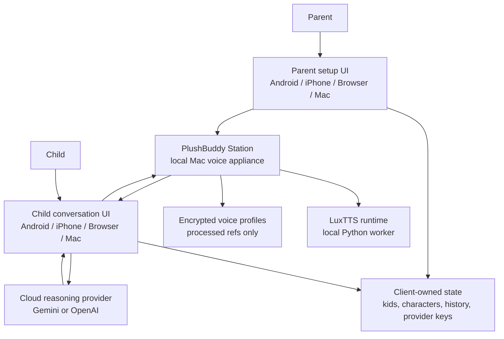
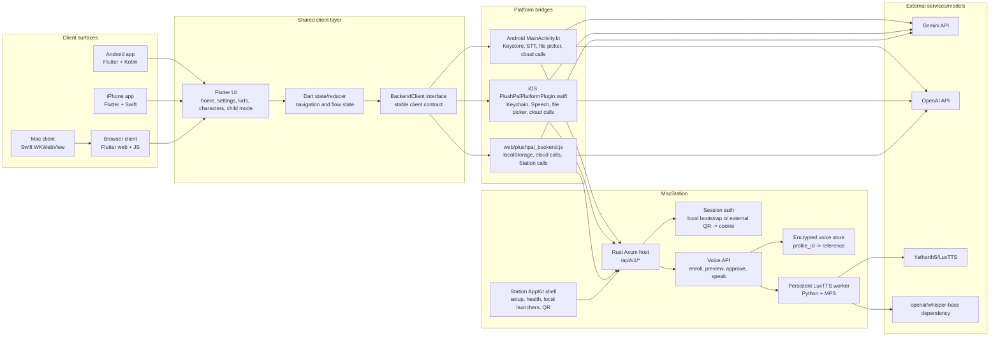
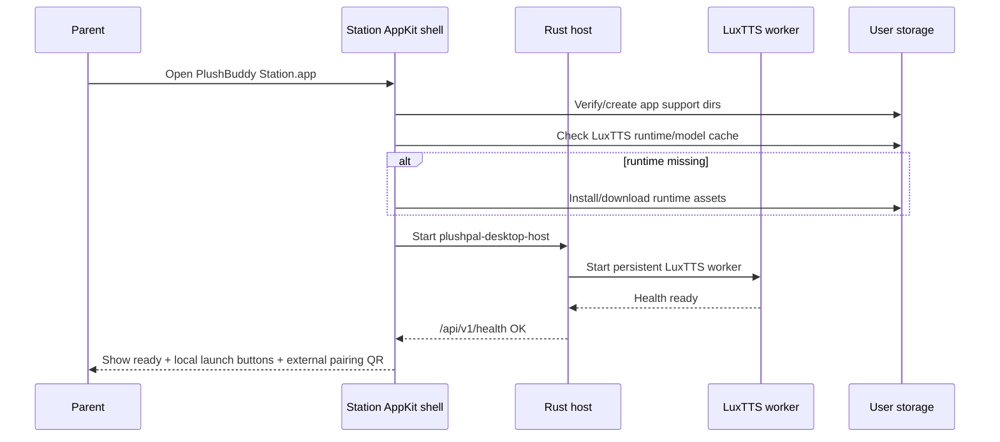
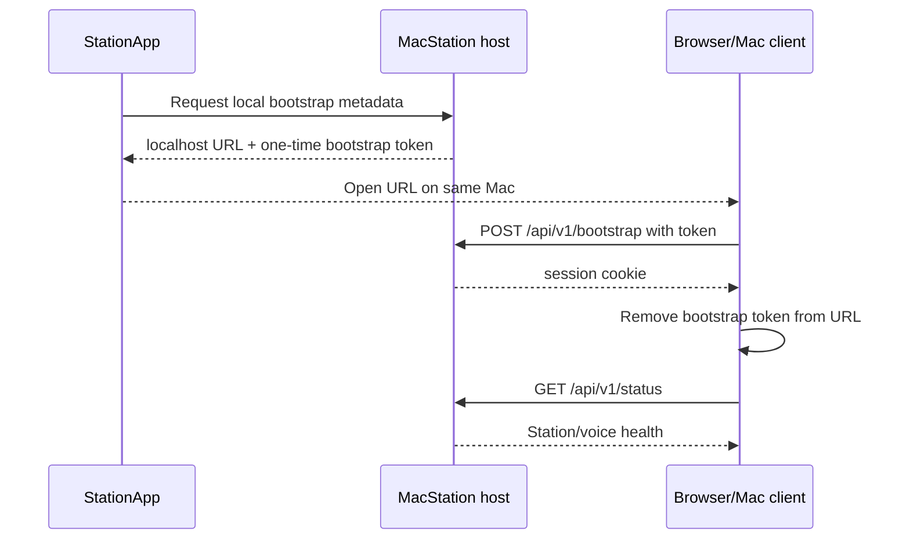
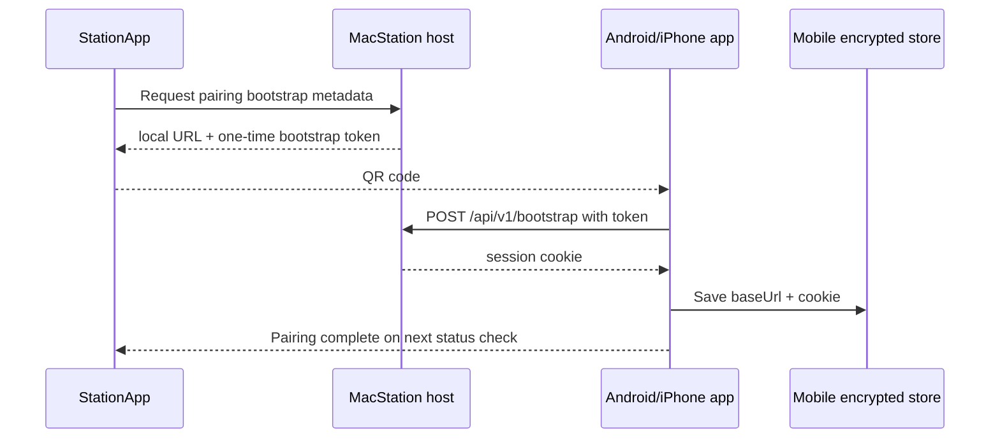
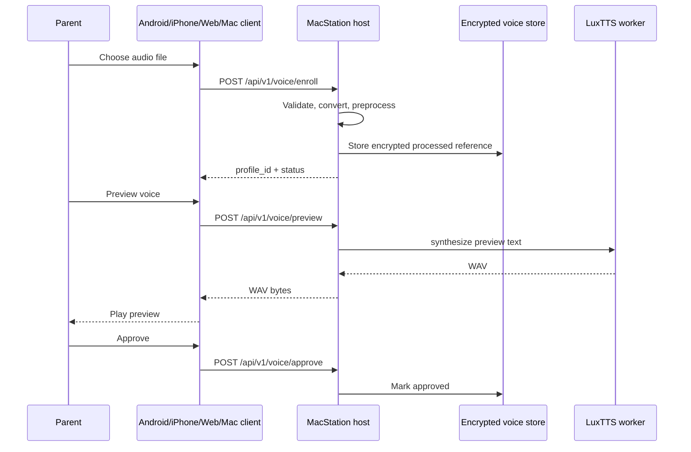
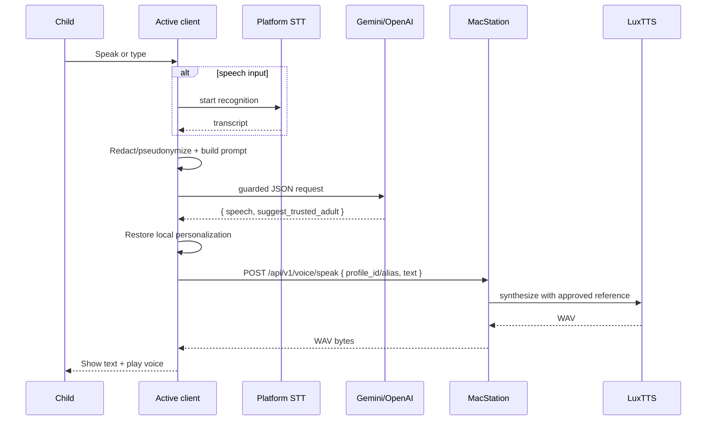
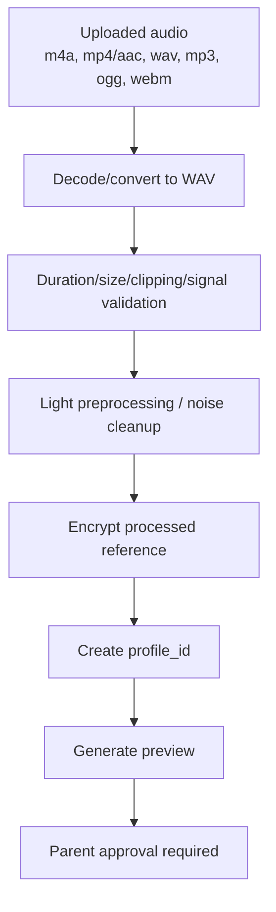
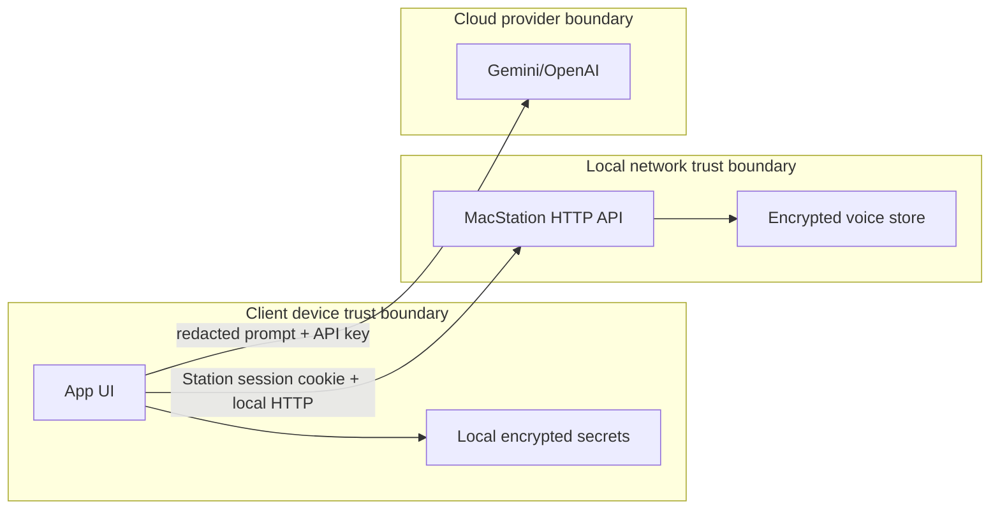

# PlushBuddy detailed system design and architecture

Last updated: 2026-06-25

## 1. Executive summary

PlushBuddy is a child-safe pretend-play companion where a parent creates toy-character profiles, provides a voice sample for each toy, approves a cloned voice preview, and lets a child talk to the toy through Android, iPhone, browser, or Mac client surfaces.

The architecture separates the system into:

1. **Clients**: Android, iPhone, browser, and Mac client app. Clients own UX, parent settings, kid profiles, character profiles, provider API keys, conversation history, and playback.
2. **MacStation**: a local Mac appliance responsible for heavyweight voice cloning and voice synthesis through LuxTTS.
3. **Cloud reasoning providers**: Gemini/OpenAI, called directly by the active client using a parent-provided API key.
4. **Shared reusable core**: Rust crates and Flutter abstractions that keep policy, data contracts, lifecycle, and platform boundaries reusable.

The most important architectural decision is that **MacStation is only the local voice appliance; it is not the reasoning backend and it is not the main app UI**. The active client owns the app experience and calls MacStation only for voice profile creation and text-to-speech in an approved character voice.

## 2. Goals and non-goals

### 2.1 Product goals

- Let a parent create up to multiple kid profiles.
- Let each kid have toy-character profiles.
- Let each character have a photo, traits/personality, parent guidance, persona age, and approved voice profile.
- Let a child speak naturally to a selected toy.
- Keep voice samples local to the family’s devices and MacStation.
- Use the highest-quality currently available voice path, even if it requires a Mac.
- Support Android as the first MVP surface while keeping iPhone, browser, and Mac client aligned.
- Allow parent-selected cloud reasoning with Gemini/OpenAI API keys.
- Keep the system understandable, reusable, and extensible.

### 2.2 Engineering goals

- Share UI and app-state logic across Android, iPhone, browser, and Mac client through Flutter.
- Encapsulate platform-specific capabilities behind a stable backend/client abstraction.
- Keep heavy local AI workloads out of phone builds.
- Keep MacStation service lifecycle observable and recoverable.
- Isolate voice model setup from user-facing clients.
- Make build/test commands reproducible.
- Keep public source publication safe: no committed secrets, no committed private samples, and build/test artifacts outside the source checkout.
- Keep security boundaries explicit: local voice, client-owned reasoning keys, encrypted local state.

### 2.3 Non-goals for the current MVP

- Fully on-device Android/iPhone voice cloning.
- Fully on-device Android/iPhone LLM reasoning.
- Managed cloud account sync.
- Managed hosted voice service.
- App Store / Play Store release readiness.
- Windows Station production support.
- Production-grade browser encrypted storage.
- Community contribution workflow. The public GitHub repository is currently a personal showcase/reference project, not an externally maintained project.

## 3. Functional requirements

| ID | Requirement | Current status |
|---|---|---|
| F1 | Parent can create and unlock parent settings with PIN | Implemented |
| F2 | Parent can create multiple kid profiles | Implemented |
| F3 | Kid profile includes name, birthdate, photo | Implemented |
| F4 | Parent can create characters under kids | Implemented |
| F5 | Character includes name, traits, guidance, persona age, photo | Implemented |
| F6 | Parent can upload common audio formats for voice profile | Implemented |
| F7 | Parent must preview and approve voice before child conversation | Implemented |
| F8 | Android/iPhone can pair with MacStation by QR/bootstrap session | Implemented |
| F8a | Local browser/Mac client auto-attaches to MacStation when opened from Station, without QR scanning | Implemented |
| F9 | Child can speak on Android/iPhone | Implemented |
| F10 | Browser/Mac client can use typed conversation | Implemented |
| F11 | Client can call Gemini/OpenAI with parent key | Implemented |
| F12 | Text response is converted to cloned voice by MacStation | Implemented |
| F13 | Conversation history is scoped by kid + character | Implemented |
| F14 | Parent can delete history and local data | Implemented |
| F15 | MacStation shows setup/service health before use | Implemented |

## 4. Non-functional requirements

| Category | Requirement | Design response |
|---|---|---|
| Privacy | Raw voice samples must not go to LLM providers | Voice samples only go to MacStation over local attach or external pairing |
| Privacy | Provider API keys should not be sent to MacStation | Cloud calls happen in active client |
| Security | Parent settings require PIN | Parent PIN gates settings portal |
| Security | Local secrets must be encrypted | Android Keystore, iOS Keychain, Mac encrypted storage |
| Reliability | Station setup should be observable | Native Station health UI |
| Performance | Avoid loading LuxTTS per turn | Persistent Python worker |
| Performance | Avoid repeated reference encoding | Prompt/reference cache by audio hash where supported |
| Reusability | Shared app UI across platforms | Flutter UI and backend contract |
| Extensibility | Swap reasoning provider | Provider abstraction supports Gemini/OpenAI |
| Extensibility | Swap voice engine | LuxTTS primary, Chatterbox fallback/research wrappers |

## 5. System context



## 6. Component architecture



## 7. Product surfaces

### 7.1 Android app

Android is the primary MVP surface.

Responsibilities:

- parent PIN setup and unlock;
- kid/character/profile management;
- character photo pick and resize;
- voice sample file pick;
- QR scan for Station pairing through `mobile_scanner`;
- Gemini/OpenAI provider key storage;
- Android SpeechRecognizer;
- conversation history;
- WAV playback from Station;
- Android Keystore-backed encrypted storage.

Important code:

```text
apps/android/flutter_app/lib/src/app.dart
apps/android/flutter_app/lib/src/backend/backend_client_stub.dart
apps/android/flutter_app/android/app/src/main/kotlin/com/plushpal/plushpal_ui/MainActivity.kt
packaging/android/build-rust.sh
```

### 7.2 iPhone app

iPhone uses the same Flutter UI and backend contract as Android, with Swift-native platform services.

Responsibilities:

- Keychain-backed storage;
- iOS document pickers for audio/photo;
- SFSpeechRecognizer + AVAudioEngine speech input;
- AVAudioPlayer WAV playback;
- Gemini/OpenAI cloud calls;
- Station pairing persistence;
- iOS simulator and unsigned device builds.

Important code:

```text
apps/android/flutter_app/ios/Runner/PlushPalPlatformPlugin.swift
apps/android/flutter_app/ios/Runner/Info.plist
apps/android/flutter_app/ios/Runner.xcodeproj/project.pbxproj
```

### 7.3 Browser client

The browser client is the same Flutter UI compiled to web, plus JavaScript backend glue.

Responsibilities:

- local browser state for parent/kid/character/history/provider settings;
- typed conversation;
- Gemini/OpenAI calls;
- Station same-origin/local-network voice APIs;
- browser audio playback.

Important code:

```text
apps/android/flutter_app/lib/src/backend/backend_client_web.dart
apps/android/flutter_app/web/plushpal_backend.js
apps/web/README.md
```

Current limitation: browser microphone/STT is not implemented as a product path yet.

### 7.4 Mac client app

The Mac client is a native wrapper around the Station-served browser UI.

Responsibilities:

- provide a double-clickable Mac app for the user-facing client;
- load Station-served local client UI in WKWebView;
- avoid owning setup/model/service lifecycle.

Important code:

```text
apps/macos/client_app/AppShell.swift
packaging/macos/ClientInfo.plist.in
```

### 7.5 PlushBuddy Station / MacStation

MacStation is the local voice appliance and setup shell.

Responsibilities:

- verify app storage;
- install/verify voice runtime assets;
- start Rust host;
- show health checks;
- create local browser/Mac bootstrap URLs and external Android/iPhone pairing QR/bootstrap URLs;
- serve browser/Mac client UI;
- enroll/preview/approve/delete/speak voice profiles;
- run persistent LuxTTS worker;
- keep encrypted processed voice references.

Important code:

```text
apps/macos/station_app/AppShell.swift
apps/station/macstation_host/src/lib.rs
tools/voice/luxtts_worker.py
tools/voice/luxtts_tts.py
tools/voice/setup_luxtts_macos.sh
packaging/macos/package.sh
```

## 8. Core reusable layers

### 8.1 Flutter app layer

The Flutter layer owns UI and app-level state. It is shared by Android, iPhone, browser, and Mac client.

Main responsibilities:

- welcome/setup checklist;
- parent settings navigation;
- kid profile screens;
- character screens;
- voice enrollment UX;
- child mode;
- conversation presentation;
- success/failure message surfaces;
- platform/backend calls through `BackendClient`.

### 8.2 BackendClient interface

`BackendClient` is the main boundary between UI and platform/system services.

Representative operations:

```text
stationPairingStatus()
pairStation(...)
reasoningProviderStatus()
configureApiKey(...)
kids(), saveKid(), deleteKid()
characters(), saveCharacter(), deleteCharacter()
pickCharacterPhoto(), saveCharacterPhoto()
voiceStatus(), enrollVoiceSample(), previewVoice(), approveVoice(), speakWithVoice()
beginLocalTurn(...)
history(), scopedHistory(), deleteHistory()
deleteAllLocalData(...)
```

This interface lets the same UI call Android-native, iOS-native, browser JS, or Station-backed behavior without directly depending on platform-specific code.

### 8.3 Rust workspace

The Rust crates provide reusable backend/domain capabilities:

| Crate | Purpose |
|---|---|
| `core_domain` | shared request/response/domain types |
| `policy_engine` | age/safety policy and deterministic checks |
| `provider_api` | provider trait/contracts |
| `application` | conversation orchestration |
| `session_engine` | session state behavior |
| `parent_controls` | parent settings/validation helpers |
| `encrypted_storage` | storage, migrations, encryption-oriented repository code |
| `character_voice` | voice metadata and validation concepts |
| `audio_core` | audio-related shared types/utilities |
| `desktop_gateway` | desktop host gateway abstractions |
| `model_lifecycle` | model manifest/download/verification lifecycle |
| `device_capability` | device capability probing |
| `curated_search` / `search_api` | earlier optional search capability |
| `cloud_provider` | cloud provider integration boundary |
| `llama_native_ffi` / `local_llm_llamacpp` | legacy/local LLM path |
| `mobile_bridge` | C ABI bridge used by mobile app builds |

The current Android/iPhone MVP uses cloud reasoning and Station voice. The older local LLaMA/Qwen path remains in the codebase as an optional/legacy local-model direction, not the default mobile conversation path.

## 9. Data model

### 9.1 KidProfile

```text
KidProfile
  id: stable local id
  name: parent-facing name
  birthdateIso: used to compute current age
  photoBytes/photoMime: optional local photo
```

Purpose:

- personalize parent UI;
- compute child age for age-appropriate responses;
- scope characters and history.

Cloud exposure:

- real name is pseudonymized/redacted before provider call where implemented;
- age context can be included.

### 9.2 CharacterConfiguration

```text
CharacterConfiguration
  alias: character name
  kidId: owning kid
  traits: personality descriptors
  parentGuidance: optional parent guidance
  personaAgeYears: how old the toy should sound/respond
  photoBytes/photoMime: optional local image
  voice: VoiceProfileStatus
```

Purpose:

- define how the toy responds;
- select approved voice profile;
- scope history and child mode.

### 9.3 VoiceProfileStatus

```text
VoiceProfileStatus
  enrolled: voice sample/profile exists
  approved: parent approved preview
  runtimeReady: Station voice runtime available
  durationMilliseconds: reference duration
  profileId: Station voice profile id
```

Purpose:

- prevent child mode from using unapproved voices;
- route speak requests to correct Station profile.

### 9.4 ConversationHistoryEntry

```text
ConversationHistoryEntry
  childText
  characterText
  completedAt
  kidId
  characterAlias
```

Purpose:

- parent review;
- scoped history;
- optional short context for provider prompts.

### 9.5 Station session attachment and pairing

```text
StationPairing
  baseUrl
  sessionCookie
  pairedAt
```

Purpose:

- authenticate local client to Station;
- route voice calls.

Local browser and Mac clients are launched by Station itself, receive a one-time bootstrap token in the launch URL, exchange it for a session cookie, and immediately remove the token from the address bar. Android and iPhone are external clients, so they receive the same bootstrap material through a QR scan and persist the resulting Station URL/session locally.

## 10. Data ownership

| Data | Android | iPhone | Browser/Mac client | MacStation | Cloud LLM |
|---|---|---|---|---|---|
| Parent PIN | encrypted local | Keychain | local browser/WebKit storage | no for mobile-owned setup | no |
| Kid profile | encrypted local | Keychain | local browser/WebKit storage | no durable mobile-owned kid state | redacted/age context only |
| Character profile | encrypted local | Keychain | local browser/WebKit storage | voice mapping only | persona context only |
| Character photo | local client | local client | local browser/WebKit storage | no durable photo ownership | no |
| Raw voice sample | transient | transient | transient | transient processing | no |
| Processed voice reference | no | no | no | encrypted local Mac storage | no |
| Voice profile id | local character state | local character state | local character state | maps to reference | no |
| Gemini/OpenAI API key | encrypted local | Keychain | browser local storage | no | used by API call |
| Conversation history | local scoped | local scoped | local scoped | no for mobile path | per-request payload only |

## 11. Main runtime flows

### 11.1 Station startup



### 11.2 Local browser/Mac attach



### 11.3 External QR pairing



### 11.3 Voice enrollment and approval



### 11.4 Child conversation



## 12. MacStation API surface

MacStation exposes a local HTTP API under `/api/v1/*`.

| Endpoint | Method | Purpose |
|---|---:|---|
| `/api/v1/health` | GET | Basic host health before authentication |
| `/api/v1/bootstrap` | POST | Exchange pairing bootstrap token for session cookie |
| `/api/v1/status` | GET | Authenticated Station status |
| `/api/v1/voice/status` | GET | Voice runtime/profile status |
| `/api/v1/voice/enroll` | POST | Upload/process voice sample |
| `/api/v1/voice/preview` | POST | Generate preview WAV |
| `/api/v1/voice/approve` | POST | Mark voice profile approved |
| `/api/v1/voice/delete` | POST | Delete voice profile/reference |
| `/api/v1/voice/speak` | POST | Generate conversation WAV |
| `/api/v1/events` | GET | WebSocket events |
| `/api/v1/commands` | POST | Local command envelope for setup/runtime actions |

Some earlier desktop/local-web parent profile endpoints remain in the host for legacy/local-web workflows. In the current mobile-first architecture, Android/iPhone own parent/kid/character state and use Station primarily for voice.

## 13. Reasoning architecture

### 13.1 Provider placement

Reasoning is called by the active client instead of MacStation.

Reasons:

- provider API key stays on the device/browser where parent entered it;
- Station does not need child conversation state;
- mobile app can reason even if Station is only used for voice;
- cloud provider choice can be client-owned and changed without Station changes.

### 13.2 Supported providers

| Provider | Current use |
|---|---|
| Gemini | `gemini-2.5-flash` path in native clients/browser |
| OpenAI | `gpt-4.1-mini` style structured JSON path in native clients/browser |

The prompt asks for JSON:

```json
{
  "speech": "short child-safe response",
  "suggest_trusted_adult": false
}
```

### 13.3 Redaction and personalization

Before cloud calls, clients can:

- redact emails;
- redact phone numbers;
- redact links;
- redact likely address-like text;
- replace kid name with deterministic pseudonym;
- include child age and character persona age.

After provider response, the client can restore the local kid name for display/playback.

## 14. Voice architecture

### 14.1 Current production voice path

| Piece | Implementation |
|---|---|
| Runtime | Python virtual environment under user/app support paths |
| Primary model | LuxTTS (`YatharthS/LuxTTS`) |
| Worker | `tools/voice/luxtts_worker.py` |
| One-shot wrapper/health | `tools/voice/luxtts_tts.py` |
| Setup script | `tools/voice/setup_luxtts_macos.sh` |
| Best current settings | `num_steps=8`, `speed=0.88`, `seed=11` |
| Reference duration | full reference up to 180 seconds |
| Acceleration | Apple Silicon/MPS where available |
| Cache | persistent worker and reference prompt cache by audio hash |

### 14.2 Voice enrollment processing



### 14.3 Why LuxTTS local instead of phone/cloud

LuxTTS gave the closest voice/tone match in local bakeoff testing, especially for the child-created toy voices. Phone-class local runtime is not practical for the current model. Cloud voice APIs tested manually did not match the sample tone well enough and would become expensive because every response requires TTS generation.

### 14.4 Alternative voice engines

| Engine/path | Current role |
|---|---|
| Chatterbox | fallback/smoke path |
| OpenVoice | bakeoff/research |
| GPT-SoVITS | bakeoff/research |
| F5/TADA | bakeoff/research |
| Pocket TTS | legacy smoke/evidence only, not product voice |

## 15. Security and privacy design

### 15.1 Trust boundaries



### 15.2 Storage protection

| Platform | Protection |
|---|---|
| Android | Android Keystore-backed encrypted storage |
| iPhone | iOS Keychain protected storage |
| Browser/Mac web | Browser/WebKit local storage for MVP |
| MacStation | SQLCipher/AES-GCM style encrypted voice reference storage |

### 15.3 Station session security

- Station creates one-time bootstrap URL/token material.
- Local browser/Mac launch receives the token directly from Station and removes it from the URL after exchange.
- Android/iPhone QR contains the same one-time bootstrap material for external pairing.
- Client exchanges bootstrap token for Station session cookie.
- External clients store Station URL/cookie locally.
- Station validates Host/Origin and bounds body sizes.

### 15.4 Cloud privacy

Cloud LLM receives:

- redacted child utterance;
- age context;
- toy character traits/persona;
- parent guidance;
- small recent context where applicable.

Cloud LLM does not receive:

- voice sample;
- voice profile reference audio;
- provider keys from other clients;
- MacStation encrypted voice store.

## 16. Performance and latency

### 16.1 Conversation latency contributors

| Step | Latency source |
|---|---|
| Speech recognition | Android/iOS speech services |
| Cloud reasoning | Gemini/OpenAI network and model latency |
| Station request | local network hop |
| LuxTTS synthesis | model inference time |
| WAV transfer | local network payload |
| Playback | client audio startup |

### 16.2 Optimizations already used

- Persistent LuxTTS worker started at Station startup.
- No per-turn Python process startup.
- No per-turn model reload.
- Reference/prompt cache by audio hash where possible.
- Shorter response prompt guidance to reduce generated audio length.
- Client disables input while response/voice playback is in progress.

### 16.3 Future optimizations

- stream audio chunks instead of waiting for full WAV;
- split long responses into sentence-level TTS chunks;
- prewarm active character profile after local attach, external pairing, or character selection;
- expose latency metrics in UI;
- add Station queue/status UI;
- consider smaller/faster voice model variant if quality remains acceptable.

## 17. Reliability and failure modes

| Failure | User impact | Current/desired handling |
|---|---|---|
| Station not running | no cloned voice | local browser/Mac shows Station unavailable; mobile shows pairing/runtime not ready |
| Mac asleep | mobile cannot reach Station | keep Mac awake guidance; future wake/retry |
| LuxTTS setup missing | no voice runtime | Station setup screen installs/verifies |
| Voice profile not approved | child mode blocked for that voice | require preview/approval |
| Cloud API key missing | no reasoning | settings checklist shows provider missing |
| Cloud API failure | no answer | visible error; retry |
| Mic busy | no transcript | platform speech error; needs clearer message |
| LAN IP changes | Android/iPhone pairing may break | re-pair external device via QR; local browser/Mac should reopen from Station |
| Browser storage cleared | browser profiles lost | future export/import |
| Android/iPhone reinstall | local client data lost | future backup/export |

## 18. Deployment and packaging

### 18.0 Public repository posture

The source repository is intended to be public for learning, portfolio, and
reference use under the MIT License. It is not currently an open contribution
project:

- external pull requests are not accepted;
- PRs from users other than the repository owner are auto-commented and closed
  by `.github/workflows/close-external-prs.yml`;
- `.github/PULL_REQUEST_TEMPLATE.md` states the policy before someone opens a PR;
- CI runs on owner pushes to `main` and manual dispatch, not on external PRs;
- recommended GitHub settings restrict pushes to `main` to the owner and disable
  Issues/Discussions/Wiki if public interaction is not desired.

Repo-side policy files:

```text
LICENSE
CONTRIBUTING.md
SECURITY.md
THIRD_PARTY.md
.github/PULL_REQUEST_TEMPLATE.md
.github/workflows/close-external-prs.yml
docs/release/GITHUB_REPOSITORY_SETTINGS.md
```

### 18.1 Build outputs

`make public-artifacts` builds from an external workspace and produces:

```text
~/Downloads/PlushPal/artifacts/macos/PlushBuddy Station.app
~/Downloads/PlushPal/artifacts/macos/PlushBuddy.app
~/Downloads/PlushPal/artifacts/macos/PlushBuddy-<version>-macos.zip
~/Downloads/PlushPal/artifacts/macos/PlushBuddy-<version>-macos.dmg
~/Downloads/PlushPal/artifacts/android/PlushBuddy-debug.apk
~/Downloads/PlushPal/artifacts/ios/PlushBuddy-iPhoneSimulator.app
~/Downloads/PlushPal/artifacts/ios/PlushBuddy-iPhoneOS-unsigned.app
```

The command uses:

```text
~/Downloads/PlushPal/build          external source/build workspace
~/Downloads/PlushPal/deps           downloaded third-party source/runtime inputs
~/Downloads/PlushPal/artifacts      generated app artifacts
~/Downloads/PlushPal/test-results   generated QA evidence
~/Downloads/PlushPal/private        local private samples and scratch data
```

The source checkout should remain free of generated build/test artifacts, private
samples, provider keys, model caches, and voice profiles.

### 18.2 Packaging responsibilities

| Script/target | Purpose |
|---|---|
| `make public-artifacts` | clean public-repo artifact build from external workspace |
| `make package-macos` | build Station and Mac client apps |
| `make android-apk` | build Android debug APK |
| `make ios-simulator` | build iPhone simulator app |
| `make ios-device` | build unsigned iPhone device app |
| `packaging/macos/package.sh` | macOS app bundle/zip/dmg packaging |
| `packaging/android/build-rust.sh` | Android Rust/native libraries |

## 19. Testing strategy

| Layer | Command/evidence |
|---|---|
| Full local quality gate | `qa/automation/run_local_quality_gate.sh` |
| Public artifact build | `make public-artifacts` |
| MacStation API | `qa/automation/macstation_api_smoke.py` |
| MacStation LuxTTS voice E2E | `qa/automation/macstation_api_smoke.py --voice-engine luxtts --synthesize --sample ...` |
| Android real-device launch | `qa/automation/android_device_smoke.sh` |
| Android Station pairing | `qa/automation/android_station_pairing_smoke.sh` |
| iPhone simulator launch | `qa/automation/ios_simulator_smoke.sh` |
| Packaged Station/browser/Mac client | release smoke evidence under `~/Downloads/PlushPal/test-results` |

`qa/automation/run_local_quality_gate.sh` runs from an external test workspace
and covers Rust workspace tests, Flutter static analysis/tests, browser Node
tests, and product layout checks without dirtying the source checkout.

Latest public-repo readiness evidence is documented in
[`docs/release/QA_TEST_PLAN_AND_EXECUTION_2026-06-25.md`](../release/QA_TEST_PLAN_AND_EXECUTION_2026-06-25.md).

Current iOS verification:

- full Xcode 26.5 installed;
- CocoaPods 1.16.2 installed;
- iOS 26.5 simulator runtime installed;
- `make ios-simulator` passes;
- simulator app launches;
- `make ios-device` passes unsigned build.

## 20. Key architectural tradeoffs

### 20.1 MacStation instead of all-on-phone voice

Chosen because LuxTTS quality is the differentiator and phone-class local runtime is not practical today.

Tradeoff:

- better voice quality;
- local voice data;
- requires Mac on same network;
- adds local attach, external pairing, and setup complexity.

### 20.2 Client-owned reasoning instead of Station reasoning

Chosen because provider API keys and conversation state belong to the active client.

Tradeoff:

- simpler privacy boundary;
- less Station responsibility;
- duplicated native provider code across Android/iOS/browser;
- cloud latency still exists.

### 20.3 Flutter shared UI

Chosen to keep Android, iPhone, browser, and Mac client aligned quickly.

Tradeoff:

- high reuse;
- native bridges still needed for storage, speech, file pickers, and audio;
- web storage/security differs from mobile.

### 20.4 Local LuxTTS instead of cloud voice

Chosen after manual cloud voice tests produced worse character-tone match and would charge per response.

Tradeoff:

- better sample similarity for current use case;
- no recurring TTS provider cost;
- local setup and Mac dependency.

## 21. Extensibility

### 21.1 Adding a new reasoning provider

1. Add provider option to UI.
2. Add encrypted key storage key.
3. Implement platform provider call in Kotlin/Swift/JS.
4. Return same structured `{ speech, suggest_trusted_adult }`.
5. Add tests for parsing, error handling, and missing-key status.

### 21.2 Adding a new voice engine

1. Add setup script under `tools/voice`.
2. Add worker/wrapper with a stable CLI/IPC contract.
3. Add Station engine adapter.
4. Add healthcheck.
5. Add preview/speak tests.
6. Run listening bakeoff against Sheru/Jenna/Buddy samples.

### 21.3 Adding Windows Station

1. Port Station shell or create native Windows launcher.
2. Validate Rust host on Windows.
3. Replace macOS-specific LuxTTS/MPS assumptions.
4. Add Windows credential/storage integration.
5. Add packaging and release tests.

## 22. Roadmap

Public GitHub repository readiness:

- source is MIT-licensed and documented;
- external PRs are not accepted and are auto-closed;
- generated build/test/private artifacts are outside the repo;
- `make public-artifacts` and local QA evidence are current as of the June 25,
  2026 QA pass.

High-priority:

- physical iPhone E2E with real camera QR, mic, local network, M4A upload, preview, approval, and conversation;
- rerun live Gemini/OpenAI UI conversation with a fresh local provider key before publishing hosted release artifacts;
- latency metrics and voice generation progress UI;
- browser/Mac microphone support;
- export/import for local profiles;
- stronger browser storage encryption;
- production signing/notarization for MacStation/Mac client;
- Android/iOS release signing pipelines.

Medium-priority:

- per-character prompt preview/debug screen;
- parent-only “test this character” mode;
- Station reconnect/reopen/re-pair guidance;
- automatic active-character prewarm;
- objective voice-similarity scoring.

Long-term:

- managed cloud option;
- optional home-server/Windows Station;
- account sync and backup;
- app store release hardening;
- child-safety red-team test suite.
