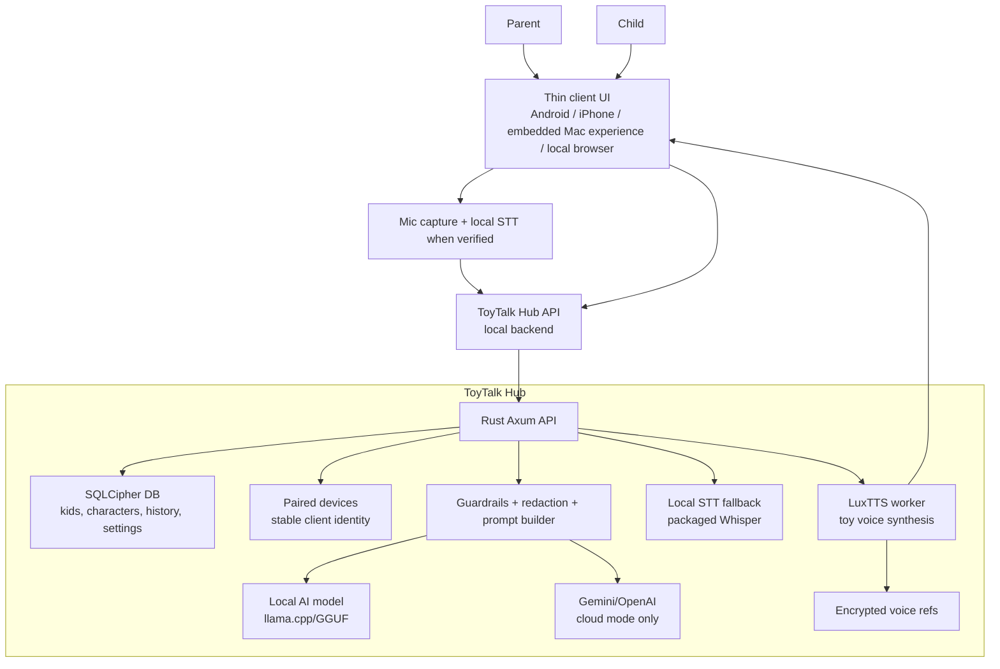
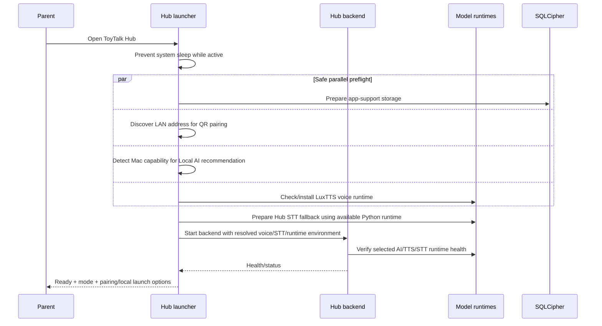
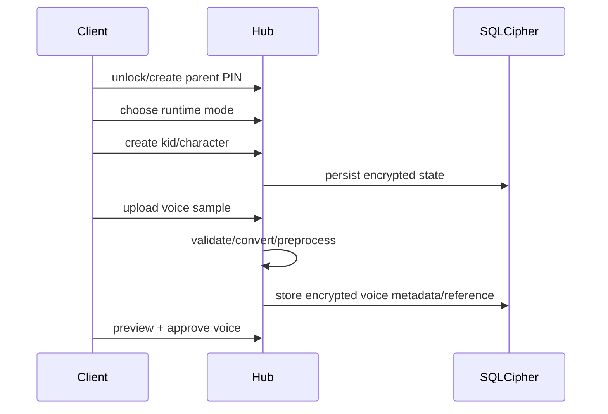
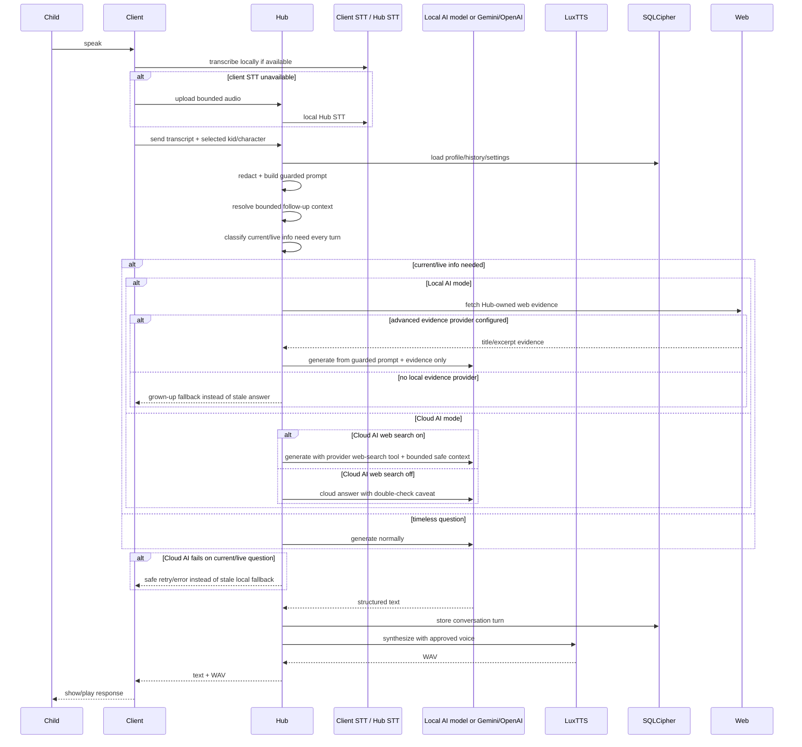

# ToyTalk Hub system design and architecture

Last updated: 2026-07-05

## 1. Executive summary

ToyTalk is a local-first pretend-play voice companion for kids’ plush toys.
A parent creates kid profiles, creates toy-character profiles, uploads a short
sample of how each toy should sound, approves the cloned voice, and a child can
talk to that toy through native clients.

The current architecture makes **ToyTalk Hub** the local private backend:

- the Hub runs first on macOS;
- Android, iPhone, and future Windows/Linux apps are thin UI clients; the local Mac desktop experience is embedded inside ToyTalk Hub;
- the browser client is local-only on the same computer as the Hub;
- durable app data is stored in Hub-owned encrypted SQLCipher stores: the Hub
  has its own stable `hub-*` scoped store for admin state, and each paired UI
  client has its own stable client-scoped encrypted store;
- all business logic, guardrails, model orchestration, and provider calls live
  in the Hub;
- clients capture input and play output, but do not own family data.

This is intentionally similar to a production cloud backend architecture, but
the backend runs on the parent’s own computer instead of AWS/GCP.

```text
Native clients + embedded Mac/local browser UI
        |
        | paired local-network session / localhost
        v
ToyTalk Hub
  root encrypted SQLCipher key/compatibility store
  Hub scoped SQLCipher store
  per-client encrypted SQLCipher stores
  kid/character/history APIs
  two runtime modes
  local STT fallback
  local or Cloud AI reasoning
  LuxTTS voice cloning and TTS
```

## 2. Current implementation status

The current implementation has completed the main Hub-first migration:

- Hub SQLCipher storage owns parent setup, kids, characters, photos, provider
  settings, conversation history, voice metadata, and provider API keys.
- Hub admin state uses a stable `hub-*` client identity. The Hub scoped store
  owns Hub parent PIN, Cloud AI provider keys, active provider, and the
  paired-device registry/revocation list.
- Browser and embedded Mac client APIs call the Hub instead of storing durable family
  data in browser/WebKit storage.
- Paired Android/iPhone clients call the Hub for parent setup, kids,
  characters, provider keys, voice lifecycle, conversation turns, and history.
- Gemini and OpenAI cloud reasoning are activated from the Hub after parent
  authorization and encrypted key storage.
- Hub-owned encrypted conversation history is the canonical memory for all
  modes. Cloud provider thread/session IDs may be used later as an opt-in
  optimization, but they are not the source of truth because Hub must perform
  safety, routing, redaction, mode selection, and cross-provider continuity
  before any provider call.
- Clients generate stable `client_id` values and send them with every private
  Hub request so Hub routing does not depend on IP address.
- Hub stores a paired-client registry with platform/label/last-seen metadata
  and parent-gated revocation in the Hub scoped store.
- Hub resolves normal family-data APIs through the request `client_id`, giving
  each paired client an isolated encrypted store for parent setup, kids,
  characters, voice profiles, and conversation history.
- Missing client IDs are rejected for private persisted APIs once the Hub has a
  persistent store, which prevents accidental fallback into a shared/root data
  bucket.

Remaining architecture work:

- broaden Mac/WebKit microphone QA for the implemented bounded-audio Hub STT
  fallback path;
- expand safety/regression evaluation for the selected local Gemma tiers and
  cloud providers.

Implemented direction:

```text
Now:
  Hub owns storage/reasoning/voice/business logic
  clients are UI + mic + playback + pairing
```

## 3. Product goals

- Voice-first child experience on Android, iPhone, the embedded Mac desktop
  experience inside Hub, and future Windows apps.
- Local-only browser UI on the same machine running the Hub.
- Parent-friendly setup with exactly two runtime choices:
  1. Local AI mode;
  2. Cloud AI.
- Encrypted single source of truth per Hub installation.
- Stable paired-client identity that does not depend on IP address.
- Best available local toy voice quality through LuxTTS.
- No raw voice samples sent to Cloud AI providers.
- Clear fallback when local/offline capability is unavailable.

## 4. Non-goals for this phase

- External browser clients over LAN.
- Browser access from phones/PCs that are not running the Hub.
- Hosted cloud account sync.
- Fully on-phone voice cloning.
- Running LuxTTS on Android/iPhone.
- Windows/Linux Hub support in the first Hub migration; those are later ports.

## 5. Supported clients

| Surface | Role | Hub connection |
|---|---|---|
| Android app | External voice-first native client | QR pairing over same Wi-Fi/LAN |
| iPhone app | External voice-first native client | QR pairing over same Wi-Fi/LAN |
| Embedded Mac experience | Native desktop client inside ToyTalk Hub | Local attach |
| Local browser | Convenience UI on the Hub machine only | `localhost` attach |
| Windows app | Future native client | QR pairing over same Wi-Fi/LAN |
| Linux app | Future native client | QR pairing over same Wi-Fi/LAN |
| Remote browser | Not supported for now | Use native app instead |

## 6. Two runtime modes

The Hub offers only two parent-facing modes.

### 6.1 Local AI mode

Everything runs locally except first-time model downloads and optional release
updates.

```text
Client STT if verified on-device
  else Hub local STT
Hub local AI model
Hub LuxTTS
Hub SQLCipher storage
```

Candidate model stack:

| Capability | Primary candidate | Notes |
|---|---|---|
| STT fallback | Lazy Hub setup using the Hub-managed Python/Transformers runtime for `openai/whisper-base`; future lean target is `whisper.cpp` | Use smaller/faster Whisper tier on lower-memory machines |
| Current-info routing | `sentence-transformers/all-MiniLM-L6-v2` embeddings + tiny ToyTalk logistic classifier | Installed by Hub setup outside the app bundle; runs on every child question to classify whether the turn needs current/live information before AI routing/search decisions |
| Cloud AI web search | Gemini/OpenAI provider-native search tools | Parent-facing setting; used only when Cloud AI is active, the parent enables Cloud AI web search, and the current-info router says the turn needs current/live information |
| Advanced Local AI web evidence | Brave Search API env hook | Developer/power-user path only; not shown in the normal parent UX. If configured, Hub can inject bounded evidence into the shared prompt contract for Local AI. Otherwise Local AI fails safe on current/live questions |
| Local AI model | `llama.cpp` + signed Google Gemma 4 E4B Q4 GGUF | Hub defaults to the latency-first local model; larger Gemma manifests remain optional/experimental |
| TTS / voice clone | LuxTTS | Current best toy-voice match using `num_steps=4`, `speed=0.88`, `seed=11`, and full approved reference up to 180 seconds |

Suggested local AI model default:

| Hub memory | Suggested Local AI tier |
|---:|---|
| 12 GB | Gemma 4 E4B Q4 |
| 16-24 GB | Gemma 4 E4B Q4 |
| 32 GB+ | Gemma 4 E4B Q4 by default; 12B/26B can be evaluated later as optional slower quality modes |

Pros:

- Maximum privacy.
- No AI API key required.
- Conversation text stays on the Hub.
- Works without cloud reasoning once models are installed.

Cons:

- Larger setup/downloads.
- More memory/CPU/GPU pressure.
- Local AI model may be less capable than Gemini/OpenAI.
- Local AI model knowledge can be stale.
- Current/live Local AI answers use a child-friendly grown-up fallback by
  default instead of guessing from stale memory. A hidden developer/power-user
  Brave Search env hook can provide evidence, but it is not part of normal
  parent setup.
- Requires broader safety and quality regression evidence before product
  release claims.

### 6.2 Cloud AI mode

Voice, storage, STT fallback, redaction, guardrails, and TTS remain local. Only
the minimized/redacted text prompt goes to the parent-selected Cloud AI.

```text
Client STT if verified on-device
  else Hub local STT
Hub prompt/guardrails/redaction
Gemini/OpenAI reasoning
Hub LuxTTS
Hub SQLCipher storage
```

Pros:

- Better answer quality.
- Smaller Local AI setup.
- Lower Hub memory requirements.
- Parent can use their own Gemini/OpenAI key.

Cons:

- Redacted conversation text leaves the home network.
- Depends on provider availability, policy, pricing, and latency.
- Requires parent consent/API key.
- Provider behavior can change over time.

## 7. Speech-to-text policy

All native clients are voice-first. The default STT policy is:

1. use verified on-device platform STT when available;
2. if unavailable or failed, fall back to Hub local STT;
3. never silently use Google/Apple/Microsoft cloud STT;
4. cloud STT, if ever added, must be an explicit parent opt-in.

| Client | Primary STT | Local-only requirement | Fallback |
|---|---|---|---|
| Android | `createOnDeviceSpeechRecognizer` | Must verify availability | Bounded local WAV capture to Hub Whisper/STT |
| iPhone | `SFSpeechRecognizer` with `requiresOnDeviceRecognition = true` | Must check `supportsOnDeviceRecognition` | Bounded local WAV capture to Hub Whisper/STT |
| Embedded Mac experience | Apple on-device speech recognition | Must enforce local mode | Hub Whisper/STT |
| Windows app future | Windows device-based/in-process recognizer | Must verify local mode | Hub Whisper/STT |
| Local browser | Browser mic on `localhost` | Can send audio to Hub | Hub Whisper/STT |

Hub STT receives compressed or bounded audio over the local session only. Cloud
Cloud AI providers receive text, not raw audio.

## 8. High-level architecture


```mermaid
flowchart TB
    Parent["Parent"] --> Client["Thin client UI<br/>Android / iPhone / embedded Mac experience / local browser"]
    Child["Child"] --> Client

    Client --> Mic["Mic capture + local STT when verified"]
    Mic --> HubAPI["ToyTalk Hub API<br/>local backend"]
    Client --> HubAPI

    subgraph Hub["ToyTalk Hub"]
        API["Rust Axum API"]
        DB["SQLCipher DB<br/>kids, characters, history, settings"]
        Pairing["Paired devices<br/>stable client identity"]
        Policy["Guardrails + redaction + prompt builder"]
        LocalSTT["Local STT fallback<br/>packaged Whisper"]
        LocalAI["Local AI model<br/>llama.cpp/GGUF"]
        CloudAI["Gemini/OpenAI<br/>cloud mode only"]
        TTS["LuxTTS worker<br/>toy voice synthesis"]
        VoiceStore["Encrypted voice refs"]
    end

    HubAPI --> API
    API --> DB
    API --> Pairing
    API --> Policy
    API --> LocalSTT
    Policy --> LocalAI
    Policy --> CloudAI
    API --> TTS
    TTS --> VoiceStore
    TTS --> Client
```

## 9. Hub responsibilities

ToyTalk Hub owns:

- parent PIN and parent settings;
- runtime mode selection;
- provider API keys and local model configuration;
- kid profiles;
- character profiles;
- character photos;
- voice sample enrollment;
- processed voice references;
- voice profile approval state;
- conversation sessions and turns;
- redaction/pseudonymization;
- prompt construction and child-safety policy;
- local/cloud reasoning;
- TTS synthesis;
- client pairing/session lifecycle;
- export/import and delete-all flows.

Clients own:

- UI rendering;
- microphone permission/capture;
- platform on-device STT when available;
- temporary audio playback;
- Hub pairing/session token;
- no durable family data beyond the minimum pairing secret.

## 10. Storage design

### 10.1 Hub database

Each Hub installation has a root encrypted SQLCipher database for Hub registry
compatibility state and key derivation:

```text
~/Library/Application Support/ToyTalk/toytalk.sqlcipher
```

The root store is not the normal product data tenant. It is retained for
compatibility, database bootstrap, key material, and migration support.

The Hub itself has a stable `hub-*` client identity and a scoped encrypted store.
The Hub scoped store owns:

- parent PIN / parent-gate profile;
- Cloud AI provider keys and active provider;
- paired-client registry;
- paired-client revocation state;
- Hub setup/runtime preferences;
- Hub audit and migration state.

Each stable paired client also gets an isolated encrypted SQLCipher store under
the Hub data directory. The store is keyed by the stable `client_id`
(`android-...`, `ios-...`, `macos-...`, `web-...`, `windows-...`,
`linux-...`) rather than by IP address, so DHCP changes do not create new
family data silos.

Per-client stores own:

- `kids`
- `characters`
- `character_voice_profiles`
- `voice_assets`
- `conversation_sessions`
- `conversation_turns`
- `schema_migrations`

### 10.2 Request routing and tenant boundary

Every private persisted API request must include:

```http
X-ToyTalk-Client-Id: <stable-client-id>
X-ToyTalk-Hub-Id: <hub-id returned during bootstrap/pairing>
X-ToyTalk-Client-Label: <friendly device label>
```

The backend uses the request client ID to resolve client-owned data such as
kids, characters, voice profiles, conversation history, and backups. For
Hub-owned APIs such as parent PIN verification/update, Cloud AI provider keys,
active provider selection, paired-device registry, and revocation, the backend
validates `X-ToyTalk-Hub-Id` and opens the Hub-scoped store. It does not
infer tenancy from IP address, LAN URL, session cookie contents, or the root DB.

The Hub macOS launcher generates and persists its own `hub-*` ID in user
defaults, passes it to the Rust host as `PLUSHPAL_HUB_CLIENT_ID`, and sends it on
all Hub-admin requests. Phone/native/web clients generate platform-specific
stable IDs, receive the Hub ID from `/api/v1/bootstrap`, persist both IDs, and
send both on every Hub API call after pairing. If the Hub ID is missing or does
not match the running Hub, Hub-owned APIs fail closed.

Revocation is also checked against the Hub scoped paired-device registry on
every authenticated request from non-Hub clients, so a parent can stop an
already-paired device without waiting for the next pairing attempt.

### 10.3 Secret storage

- The SQLCipher DB key is stored/wrapped by platform secure storage.
- On macOS, use Keychain where practical.
- Provider API keys are stored as encrypted SQLCipher records in the Hub scoped
  store; they must not be returned to clients or logs.
- Voice reference files are encrypted separately and referenced from SQLCipher.

### 10.4 Client storage

Native external clients store only:

- stable client ID (`android-...`, `ios-...`, or equivalent);
- client key pair or device secret;
- Hub URL/last-known address;
- session token/cookie;
- tiny non-sensitive UI cache if needed.

Paired clients do not store kids, characters, API keys, or history in product
usage. Hub demo/mock modes are backend runtimes only; external clients still
call Hub APIs and keep only identity, pairing/session, theme/UI preference, and
temporary platform-helper state.

## 11. Stable paired-client identity

Do not use IP address as identity. IP addresses change.

Pairing flow:

1. Client generates a stable `client_id`.
2. Client generates a device key pair or high-entropy device secret.
3. Parent opens Hub pairing QR.
4. QR contains a one-time bootstrap token and Hub address.
5. Client exchanges bootstrap token plus `client_id`/public key.
6. Hub stores the device in `paired_clients` and returns `X-ToyTalk-Hub-Id`.
7. Client persists the Hub ID with its pairing credentials.
8. Future sessions authenticate with the device credential and receive a short
   session token.

Hub stores:

```text
paired_clients
  client_id
  device_label
  platform
  public_key_or_secret_ref
  created_at
  last_seen_at
  last_seen_ip
  revoked_at
```

`last_seen_ip` is diagnostics only. If the phone gets a new IP, the same
`client_id` still maps to the same device and the same Hub data.

If an app is uninstalled or browser/site data is cleared, a new client identity
is created and the parent can revoke the old one from Hub settings.

## 12. Pairing and networking

- Local browser on the Hub machine uses `localhost` and does not need QR.
- The embedded Mac experience on the Hub machine uses local attach.
- Android/iPhone native apps use QR pairing.
- Remote browsers are not supported.
- Hub should keep the host machine awake while active.
- Hub should show LAN reachability and paired-device status.

## 13. Runtime flows

### 13.1 Startup


```mermaid
sequenceDiagram
    participant Parent
    participant Shell as Hub launcher
    participant Hub as Hub backend
    participant Models as Model runtimes
    participant DB as SQLCipher

    Parent->>Shell: Open ToyTalk Hub
    Shell->>Shell: Prevent system sleep while active
    par Safe parallel preflight
        Shell->>DB: Prepare app-support storage
    and
        Shell->>Shell: Discover LAN address for QR pairing
    and
        Shell->>Shell: Detect Mac capability for Local AI recommendation
    and
        Shell->>Models: Check/install LuxTTS voice runtime
    end
    Shell->>Models: Prepare Hub STT fallback using available Python runtime
    Shell->>Hub: Start backend with resolved voice/STT/runtime environment
    Hub->>Models: Verify selected AI/TTS/STT runtime health
    Hub-->>Shell: Health/status
    Shell-->>Parent: Ready + mode + pairing/local launch options
```

The Hub intentionally does not expose pairing, browser, or local-Mac launch
options until the final health gate passes. Parallel setup is used to reduce
startup time without creating a confusing partially usable state where parents
can configure clients before buddy voices and Hub services are ready.

### 13.2 Parent setup


```mermaid
sequenceDiagram
    participant Client
    participant Hub
    participant DB as SQLCipher

    Client->>Hub: unlock/create parent PIN
    Client->>Hub: choose runtime mode
    Client->>Hub: create kid/character
    Hub->>DB: persist encrypted state
    Client->>Hub: upload voice sample
    Hub->>Hub: validate/convert/preprocess
    Hub->>DB: store encrypted voice metadata/reference
    Client->>Hub: preview + approve voice
```

### 13.3 Child conversation


```mermaid
sequenceDiagram
    participant Child
    participant Client
    participant Hub
    participant STT as Client STT / Hub STT
    participant Reason as Local AI model or Gemini/OpenAI
    participant Lux as LuxTTS
    participant DB as SQLCipher

    Child->>Client: speak
    Client->>STT: transcribe locally if available
    alt client STT unavailable
        Client->>Hub: upload bounded audio
        Hub->>STT: local Hub STT
    end
    Client->>Hub: send transcript + selected kid/character
    Hub->>DB: load profile/history/settings
    Hub->>Hub: redact + build guarded prompt
    Hub->>Hub: resolve bounded follow-up context
    Hub->>Hub: classify current/live info need every turn
    alt current/live info needed
        alt Local AI mode
            Hub->>Web: fetch Hub-owned web evidence
            alt advanced evidence provider configured
                Web-->>Hub: title/excerpt evidence
                Hub->>Reason: generate from guarded prompt + evidence only
            else no local evidence provider
                Hub-->>Client: grown-up fallback instead of stale answer
            end
        else Cloud AI mode
            alt Cloud AI web search on
                Hub->>Reason: generate with provider web-search tool + bounded safe context
            else Cloud AI web search off
                Hub->>Reason: cloud answer with double-check caveat
            end
        end
    else timeless question
        Hub->>Reason: generate normally
    end
    alt Cloud AI fails on current/live question
        Hub-->>Client: safe retry/error instead of stale local fallback
    end
    Reason-->>Hub: structured text
    Hub->>DB: store conversation turn
    Hub->>Lux: synthesize with approved voice
    Lux-->>Hub: WAV
    Hub-->>Client: text + WAV
    Client-->>Child: show/play response
```

## 14. Security and privacy boundaries

- Hub is the only durable store of family data in paired product usage.
- SQLCipher protects Hub records at rest.
- Voice samples stay on the local network and are not sent to Gemini/OpenAI.
- Cloud AI mode sends only minimized/redacted text.
- Cloud AI prompts include bounded recent turns and safe city/area context when
  needed to resolve follow-ups such as “around me.” Recent turns are explicitly
  marked as context only; providers are instructed to answer the current child
  message rather than continuing an older topic.
- Local-first mode sends no conversation text to Cloud AI providers.
- The current-info router runs locally on the Hub for every child question. It
  classifies routing only; it does not answer the child or persist prompts
  outside the normal local Hub logs/history path.
- Cloud AI web search is parent-controlled in the encrypted Hub settings. If
  enabled and the classifier marks a turn as current/live, Gemini/OpenAI may use
  their native web-search tools. If disabled, Cloud AI responses carry a
  kid-friendly double-check caveat for current/live turns.
- Local AI is local-first in the normal UX: if a turn needs current/live
  information, Hub returns a kid-friendly grown-up fallback instead of using
  stale model memory. A hidden Brave Search env hook can be used for advanced
  Local AI evidence experiments; when present, the prompt contract instructs the
  model to answer only from that evidence.

### 14.1 Conversation memory and provider-managed cloud state

ToyTalk uses Hub-owned memory first:

- every private client request carries a stable `client_id` and Hub/session
  authentication;
- Hub opens the matching encrypted SQLCipher store for that client;
- Hub loads the selected kid, character, persona, parent guidance, settings, and
  recent character-scoped conversation turns;
- Hub performs redaction, current-info routing, safety checks, runtime-mode
  selection, and prompt construction before calling Local AI, Gemini, or OpenAI.

This design keeps conversation continuity consistent when the parent switches
between Local AI, Gemini, and OpenAI. It also lets Hub resolve follow-ups such
as:

1. Child: “How is the weather?”
2. Toy: “Tell me where you are?”
3. Child: “I am in San Jose.”
4. Later child: “What is happening today around me?”

The Hub can use the prior safe city-level context (“San Jose”) without storing
or asking for precise addresses, schools, contact details, or private location.

OpenAI and Gemini both expose provider-managed multi-turn mechanisms in their
modern APIs. ToyTalk treats those IDs as optional cloud-provider acceleration
metadata, not canonical memory:

- provider state must be parent-consented because it can cause the provider to
  retain conversation state outside the Hub;
- Hub still sends the current guardrails/system instructions, response schema,
  tools/search setting, child/character context, and bounded Hub context each
  turn;
- Hub must continue to work if provider state is unavailable, reset, provider is
  changed, or Local AI is selected;
- Local AI does not rely on provider thread IDs and uses Hub-owned history plus
  optional local in-memory model/session caches.

Current implementation status: Hub-owned encrypted history and bounded cloud
prompt context are active. Provider-managed OpenAI/Gemini thread IDs are
documented as a future explicit opt-in because the current privacy-first Cloud
AI path avoids hidden provider-side durable conversation state.
- Clients must authenticate every Hub API call.
- Parent PIN gates settings and destructive actions.
- Device revocation must be supported.
- Logs must avoid child content, API keys, raw prompts, and raw audio.

## 15. Performance

Primary latency contributors:

| Step | Notes |
|---|---|
| STT | Client local STT is fastest; Hub STT fallback adds audio upload + model latency |
| Reasoning | Local AI model depends on model size; Cloud AI depends on provider latency |
| TTS | LuxTTS quality path remains the largest local compute step |
| Transfer | LAN audio/WAV transfer is usually smaller than model latency |

Performance tactics:

- keep LuxTTS worker warm;
- keep selected local AI model loaded when in Local AI mode;
- keep STT model warm if Hub fallback is enabled;
- cap prompt/history length;
- prewarm active character voice reference;
- show visible latency breakdown in diagnostics.

## 16. Platform roadmap

1. Broaden Local AI model safety and quality regression coverage.
2. Broaden Mac/WebKit microphone QA and optimize Hub STT runtime packaging.
3. Windows Hub launcher/runtime.
4. Linux Hub launcher/runtime.

## 17. Remaining implementation work

- Broaden local/cloud reasoning safety regression coverage.
- Polish Hub runtime-mode setup screen around the two parent-facing choices.
- Broaden Mac/WebKit microphone QA for the implemented Hub STT fallback.
- Keep legacy `macstation` source-directory names as internal implementation
  details until a future non-functional repository cleanup.
