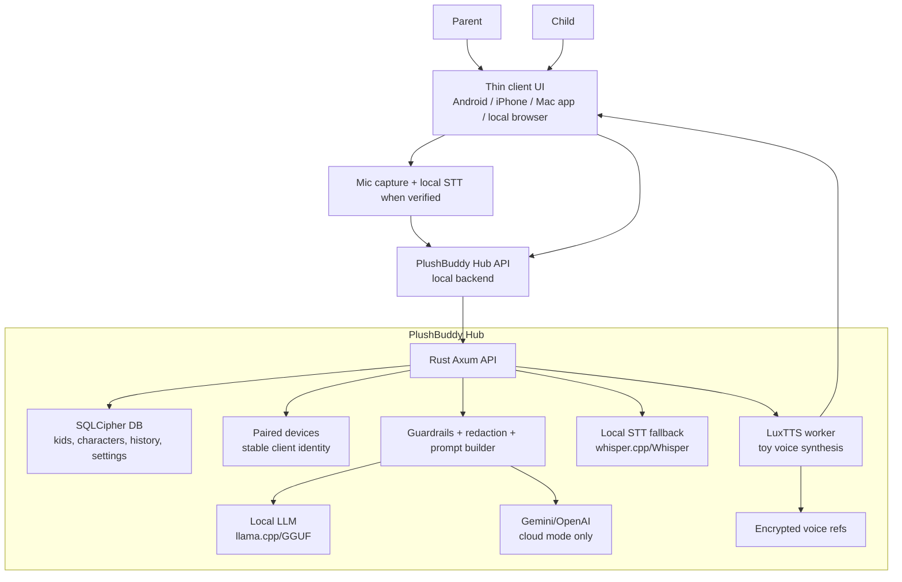
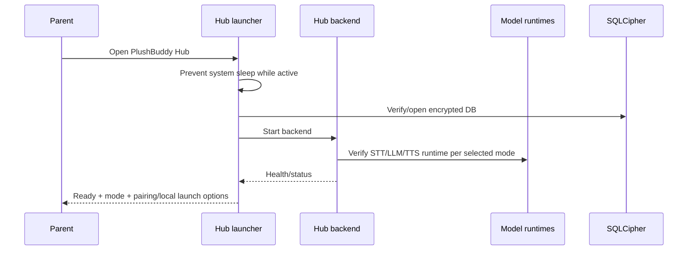
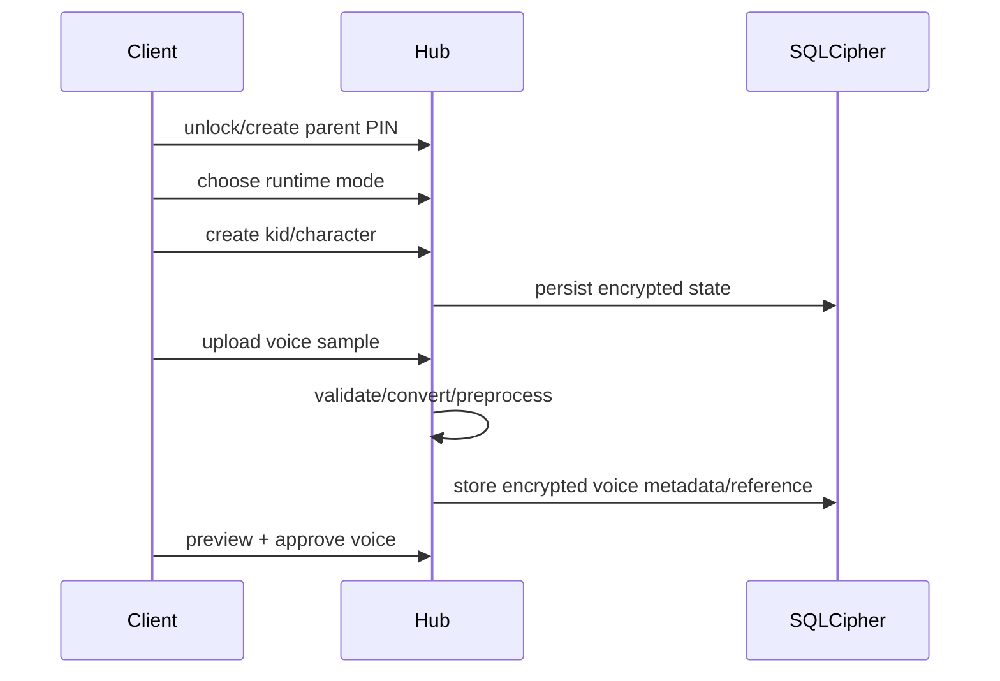
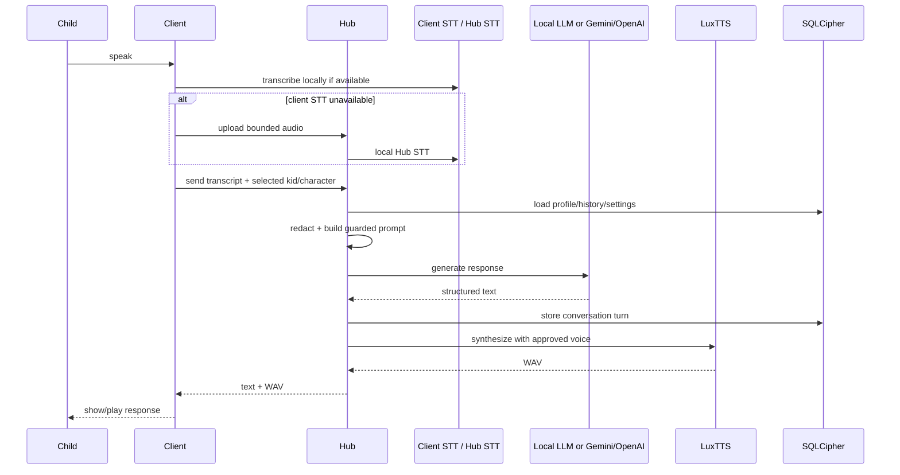

# PlushBuddy Hub system design and architecture

Last updated: 2026-07-02

## 1. Executive summary

PlushBuddy is a local-first pretend-play voice companion for kids’ plush toys.
A parent creates kid profiles, creates toy-character profiles, uploads a short
sample of how each toy should sound, approves the cloned voice, and a child can
talk to that toy through native clients.

The vNext architecture makes **PlushBuddy Hub** the local private backend:

- the Hub runs first on macOS;
- Android, iPhone, Mac app, and future Windows/Linux apps are thin UI clients;
- the browser client is local-only on the same computer as the Hub;
- all durable app data is stored in the Hub’s encrypted SQLCipher database;
- all business logic, guardrails, model orchestration, and provider calls live
  in the Hub;
- clients capture input and play output, but do not own family data.

This is intentionally similar to a production cloud backend architecture, but
the backend runs on the parent’s own computer instead of AWS/GCP.

```text
Native clients + local browser UI
        |
        | paired local-network session / localhost
        v
PlushBuddy Hub
  encrypted SQLCipher DB
  kid/character/history APIs
  two runtime modes
  local STT fallback
  local or cloud LLM reasoning
  LuxTTS voice cloning and TTS
```

## 2. Current implementation versus target architecture

The current public prerelease still contains parts of the earlier architecture:
some Android/iPhone/browser paths own local profile/history/provider state and
call Gemini/OpenAI directly. The target architecture documented here is the
next implementation direction and should be treated as the canonical design
north star.

Migration goal:

```text
Old:
  clients own storage/reasoning
  Station owns mostly voice

New:
  Hub owns storage/reasoning/voice/business logic
  clients are UI + mic + playback + pairing
```

## 3. Product goals

- Voice-first child experience on Android, iPhone, Mac app, and future Windows
  apps.
- Local-only browser UI on the same machine running the Hub.
- Parent-friendly setup with exactly two runtime choices:
  1. privacy local-first;
  2. cloud LLM.
- Encrypted single source of truth per Hub installation.
- Stable paired-client identity that does not depend on IP address.
- Best available local toy voice quality through LuxTTS.
- No raw voice samples sent to cloud LLM providers.
- Clear fallback when local/offline capability is unavailable.

## 4. Non-goals for this phase

- External browser clients over LAN.
- Browser access from phones/PCs that are not running the Hub.
- Hosted cloud account sync.
- Fully on-phone voice cloning.
- Running LuxTTS on Android/iPhone.
- Windows/Linux Hub support in the first Hub migration; those are later ports.

## 5. Supported clients

| Surface | Role | Hub connection |
|---|---|---|
| Android app | External voice-first native client | QR pairing over same Wi-Fi/LAN |
| iPhone app | External voice-first native client | QR pairing over same Wi-Fi/LAN |
| Mac app | Native client; can run on Hub Mac or another Mac | Local attach or QR pairing |
| Local browser | Convenience UI on the Hub machine only | `localhost` attach |
| Windows app | Future native client | QR pairing over same Wi-Fi/LAN |
| Linux app | Future native client | QR pairing over same Wi-Fi/LAN |
| Remote browser | Not supported for now | Use native app instead |

## 6. Two runtime modes

The Hub offers only two parent-facing modes.

### 6.1 Privacy local-first mode

Everything runs locally except first-time model downloads and optional release
updates.

```text
Client STT if verified on-device
  else Hub local STT
Hub local LLM
Hub LuxTTS
Hub SQLCipher storage
```

Candidate model stack:

| Capability | Primary candidate | Notes |
|---|---|---|
| STT fallback | `whisper.cpp` + Whisper `large-v3-turbo` | Use smaller Whisper model on lower-memory machines |
| Local LLM | `llama.cpp` + Qwen3/Gemma/Llama GGUF | Hub recommends model by memory |
| TTS / voice clone | LuxTTS | Current best toy-voice match |

Suggested local LLM tiers:

| Hub memory | Suggested local reasoning tier |
|---:|---|
| 12 GB | Qwen3 4B Q4 or Llama 3.2 3B Q4 |
| 16 GB | Qwen3 4B/8B Q4 |
| 24 GB | Qwen3 8B/14B Q4 or Gemma 12B Q4 after bakeoff |

Pros:

- Maximum privacy.
- No LLM API key required.
- Conversation text stays on the Hub.
- Works without cloud reasoning once models are installed.

Cons:

- Larger setup/downloads.
- More memory/CPU/GPU pressure.
- Local LLM may be less capable than Gemini/OpenAI.
- Local LLM knowledge can be stale.
- Requires model quality/safety bakeoff before product claims.

### 6.2 Cloud LLM mode

Voice, storage, STT fallback, redaction, guardrails, and TTS remain local. Only
the minimized/redacted text prompt goes to the parent-selected cloud LLM.

```text
Client STT if verified on-device
  else Hub local STT
Hub prompt/guardrails/redaction
Gemini/OpenAI reasoning
Hub LuxTTS
Hub SQLCipher storage
```

Pros:

- Better answer quality.
- Smaller local reasoning setup.
- Lower Hub memory requirements.
- Parent can use their own Gemini/OpenAI key.

Cons:

- Redacted conversation text leaves the home network.
- Depends on provider availability, policy, pricing, and latency.
- Requires parent consent/API key.
- Provider behavior can change over time.

## 7. Speech-to-text policy

All native clients are voice-first. The default STT policy is:

1. use verified on-device platform STT when available;
2. if unavailable or failed, fall back to Hub local STT;
3. never silently use Google/Apple/Microsoft cloud STT;
4. cloud STT, if ever added, must be an explicit parent opt-in.

| Client | Primary STT | Local-only requirement | Fallback |
|---|---|---|---|
| Android | `createOnDeviceSpeechRecognizer` | Must verify availability | Hub Whisper/STT |
| iPhone | `SFSpeechRecognizer` with `requiresOnDeviceRecognition = true` | Must check `supportsOnDeviceRecognition` | Hub Whisper/STT |
| Mac app | Apple on-device speech recognition | Must enforce local mode | Hub Whisper/STT |
| Windows app future | Windows device-based/in-process recognizer | Must verify local mode | Hub Whisper/STT |
| Local browser | Browser mic on `localhost` | Can send audio to Hub | Hub Whisper/STT |

Hub STT receives compressed or bounded audio over the local session only. Cloud
LLM providers receive text, not raw audio.

## 8. High-level architecture


```mermaid
flowchart TB
    Parent["Parent"] --> Client["Thin client UI<br/>Android / iPhone / Mac app / local browser"]
    Child["Child"] --> Client

    Client --> Mic["Mic capture + local STT when verified"]
    Mic --> HubAPI["PlushBuddy Hub API<br/>local backend"]
    Client --> HubAPI

    subgraph Hub["PlushBuddy Hub"]
        API["Rust Axum API"]
        DB["SQLCipher DB<br/>kids, characters, history, settings"]
        Pairing["Paired devices<br/>stable client identity"]
        Policy["Guardrails + redaction + prompt builder"]
        LocalSTT["Local STT fallback<br/>whisper.cpp/Whisper"]
        LocalLLM["Local LLM<br/>llama.cpp/GGUF"]
        CloudLLM["Gemini/OpenAI<br/>cloud mode only"]
        TTS["LuxTTS worker<br/>toy voice synthesis"]
        VoiceStore["Encrypted voice refs"]
    end

    HubAPI --> API
    API --> DB
    API --> Pairing
    API --> Policy
    API --> LocalSTT
    Policy --> LocalLLM
    Policy --> CloudLLM
    API --> TTS
    TTS --> VoiceStore
    TTS --> Client
```

## 9. Hub responsibilities

PlushBuddy Hub owns:

- parent PIN and parent settings;
- runtime mode selection;
- provider API keys and local model configuration;
- kid profiles;
- character profiles;
- character photos;
- voice sample enrollment;
- processed voice references;
- voice profile approval state;
- conversation sessions and turns;
- redaction/pseudonymization;
- prompt construction and child-safety policy;
- local/cloud reasoning;
- TTS synthesis;
- client pairing/session lifecycle;
- export/import and delete-all flows.

Clients own:

- UI rendering;
- microphone permission/capture;
- platform on-device STT when available;
- temporary audio playback;
- Hub pairing/session token;
- no durable family data beyond the minimum pairing secret.

## 10. Storage design

### 10.1 Hub database

Each Hub installation has one encrypted SQLCipher database:

```text
~/Library/Application Support/PlushPal/plushbuddy-hub.sqlcipher
```

Current implementation may still use `plushpal.sqlcipher`; the target name is
`plushbuddy-hub.sqlcipher`.

Tables/collections:

- `hub_settings`
- `runtime_mode`
- `provider_secrets`
- `kids`
- `characters`
- `character_voice_profiles`
- `voice_assets`
- `conversation_sessions`
- `conversation_turns`
- `paired_clients`
- `client_sessions`
- `schema_migrations`
- `audit_events`

### 10.2 Secret storage

- The SQLCipher DB key is stored/wrapped by platform secure storage.
- On macOS, use Keychain where practical.
- Provider API keys may be stored as Keychain references or encrypted DB
  records, but they must not be returned to clients or logs.
- Voice reference files are encrypted separately and referenced from SQLCipher.

### 10.3 Client storage

Native external clients store only:

- client ID;
- client key pair or device secret;
- Hub URL/last-known address;
- session token/cookie;
- tiny non-sensitive UI cache if needed.

Clients do not store kids, characters, API keys, or history in the target Hub
architecture.

## 11. Stable paired-client identity

Do not use IP address as identity. IP addresses change.

Pairing flow:

1. Client generates a stable `client_id`.
2. Client generates a device key pair or high-entropy device secret.
3. Parent opens Hub pairing QR.
4. QR contains a one-time bootstrap token and Hub address.
5. Client exchanges bootstrap token plus `client_id`/public key.
6. Hub stores the device in `paired_clients`.
7. Future sessions authenticate with the device credential and receive a short
   session token.

Hub stores:

```text
paired_clients
  client_id
  device_label
  platform
  public_key_or_secret_ref
  created_at
  last_seen_at
  last_seen_ip
  revoked_at
```

`last_seen_ip` is diagnostics only. If the phone gets a new IP, the same
`client_id` still maps to the same device and the same Hub data.

If an app is uninstalled or browser/site data is cleared, a new client identity
is created and the parent can revoke the old one from Hub settings.

## 12. Pairing and networking

- Local browser on the Hub machine uses `localhost` and does not need QR.
- Mac app on the same Hub machine can use local attach.
- Android/iPhone/Mac app from another device uses QR pairing.
- Remote browsers are not supported.
- Hub should keep the host machine awake while active.
- Hub should show LAN reachability and paired-device status.

## 13. Runtime flows

### 13.1 Startup


```mermaid
sequenceDiagram
    participant Parent
    participant Shell as Hub launcher
    participant Hub as Hub backend
    participant Models as Model runtimes
    participant DB as SQLCipher

    Parent->>Shell: Open PlushBuddy Hub
    Shell->>Shell: Prevent system sleep while active
    Shell->>DB: Verify/open encrypted DB
    Shell->>Hub: Start backend
    Hub->>Models: Verify STT/LLM/TTS runtime per selected mode
    Hub-->>Shell: Health/status
    Shell-->>Parent: Ready + mode + pairing/local launch options
```

### 13.2 Parent setup


```mermaid
sequenceDiagram
    participant Client
    participant Hub
    participant DB as SQLCipher

    Client->>Hub: unlock/create parent PIN
    Client->>Hub: choose runtime mode
    Client->>Hub: create kid/character
    Hub->>DB: persist encrypted state
    Client->>Hub: upload voice sample
    Hub->>Hub: validate/convert/preprocess
    Hub->>DB: store encrypted voice metadata/reference
    Client->>Hub: preview + approve voice
```

### 13.3 Child conversation


```mermaid
sequenceDiagram
    participant Child
    participant Client
    participant Hub
    participant STT as Client STT / Hub STT
    participant Reason as Local LLM or Gemini/OpenAI
    participant Lux as LuxTTS
    participant DB as SQLCipher

    Child->>Client: speak
    Client->>STT: transcribe locally if available
    alt client STT unavailable
        Client->>Hub: upload bounded audio
        Hub->>STT: local Hub STT
    end
    Client->>Hub: send transcript + selected kid/character
    Hub->>DB: load profile/history/settings
    Hub->>Hub: redact + build guarded prompt
    Hub->>Reason: generate response
    Reason-->>Hub: structured text
    Hub->>DB: store conversation turn
    Hub->>Lux: synthesize with approved voice
    Lux-->>Hub: WAV
    Hub-->>Client: text + WAV
    Client-->>Child: show/play response
```

## 14. Security and privacy boundaries

- Hub is the only durable store of family data in the target architecture.
- SQLCipher protects Hub records at rest.
- Voice samples stay on the local network and are not sent to Gemini/OpenAI.
- Cloud LLM mode sends only minimized/redacted text.
- Local-first mode sends no conversation text to cloud LLMs.
- Clients must authenticate every Hub API call.
- Parent PIN gates settings and destructive actions.
- Device revocation must be supported.
- Logs must avoid child content, API keys, raw prompts, and raw audio.

## 15. Performance

Primary latency contributors:

| Step | Notes |
|---|---|
| STT | Client local STT is fastest; Hub STT fallback adds audio upload + model latency |
| Reasoning | Local LLM depends on model size; cloud LLM depends on provider latency |
| TTS | LuxTTS quality path remains the largest local compute step |
| Transfer | LAN audio/WAV transfer is usually smaller than model latency |

Performance tactics:

- keep LuxTTS worker warm;
- keep selected local LLM loaded when in local-first mode;
- keep STT model warm if Hub fallback is enabled;
- cap prompt/history length;
- prewarm active character voice reference;
- show visible latency breakdown in diagnostics.

## 16. Platform roadmap

1. macOS Hub migration.
2. Thin Android/iPhone/Mac clients using Hub APIs.
3. Local-only browser UI backed entirely by Hub APIs.
4. Local-first mode model bakeoff and setup UX.
5. Cloud LLM mode migration so Hub, not clients, calls Gemini/OpenAI.
6. Windows Hub launcher/runtime.
7. Linux Hub launcher/runtime.

## 17. Remaining implementation work

- Move client-owned kid/character/history/provider storage into Hub APIs.
- Move Gemini/OpenAI calls from clients into Hub.
- Add Hub runtime-mode setup screen with only two choices.
- Add local LLM runtime behind llama.cpp.
- Add Hub STT fallback behind whisper.cpp or equivalent.
- Enforce local-only STT on Android/iPhone/Mac clients before using platform
  speech APIs.
- Add stable paired-client identity and device revocation.
- Rename user-facing MacStation language to PlushBuddy Hub.
- Keep old `MacStation` code paths only as implementation names until renamed.
