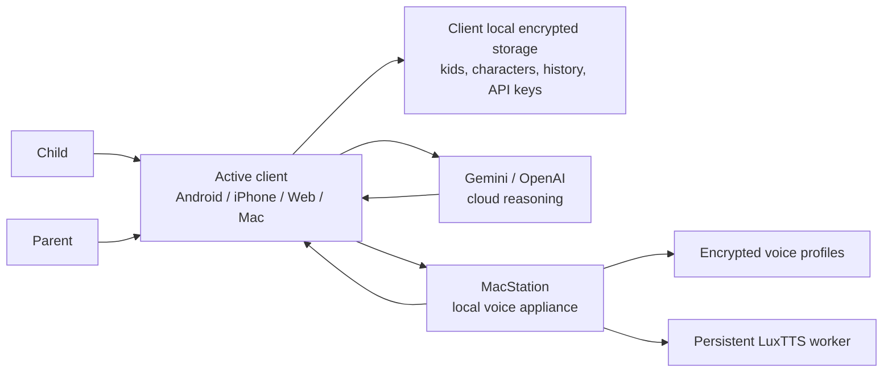
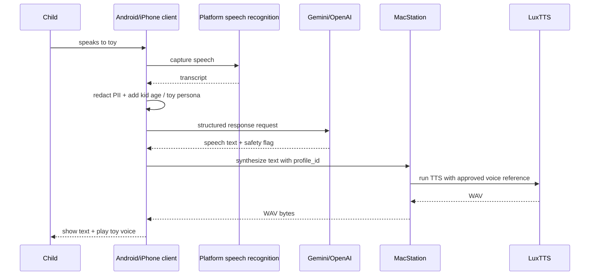
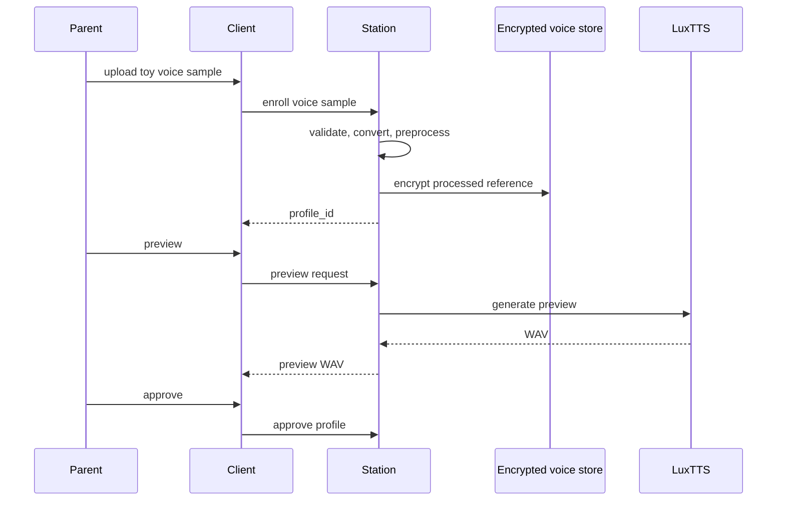

# PlushBuddy system design interview prep

Last updated: 2026-06-25

This document is written like a system design interview preparation guide. It explains how to present PlushBuddy clearly, what design choices to emphasize, where the hard problems are, and how to answer follow-up questions.

For the full professional architecture document, see [SYSTEM_DESIGN.md](SYSTEM_DESIGN.md).

Repository note: the public GitHub repository is MIT-licensed and public for
learning/portfolio/reference use, but it is not currently accepting external
pull requests or direct contributions.

## 1. One-minute pitch

PlushBuddy is a local-first AI toy companion app. A parent creates kid and toy-character profiles, uploads a short sample of how a toy should sound, approves a voice preview, and then a child can talk to that toy. The Android/iPhone/browser/Mac clients own the UX, parent settings, characters, history, and cloud reasoning keys. A local MacStation owns the heavy voice model, LuxTTS, and acts as a private local voice appliance. During conversation, the client captures speech, calls Gemini/OpenAI for a child-safe response, sends only the response text and selected voice profile to MacStation, receives a generated WAV in the toy voice, and plays it back.

The key architectural split is:

- **clients own interaction and reasoning**;
- **MacStation owns heavyweight local voice generation**;
- **cloud LLM never receives voice samples**.

## 2. Problem statement

Design a cross-platform app that lets children talk to pretend-play toy characters using cloned toy voices, while keeping parent data and voice samples local as much as possible.

Important constraints:

- high-quality voice cloning is the core product differentiator;
- Android/iPhone cannot practically run the selected voice model locally today;
- cloud voice APIs tested manually did not preserve the character tone well enough;
- conversation reasoning can use cloud LLMs with parent consent/API key;
- child data and uploaded samples should be minimized and protected;
- Android is the MVP client, but iPhone/browser/Mac should share as much code as possible.

## 3. Requirements to clarify in an interview

### Functional requirements

- Parents can create kid profiles.
- Parents can create toy-character profiles per kid.
- Parents can upload a voice sample for each character.
- Parents can preview and approve voice before use.
- Children can talk to a selected character.
- Responses should be age-appropriate and toy-persona-appropriate.
- Android and iPhone should support speech input.
- Browser and Mac client should support at least typed input.
- Conversation history should be scoped by kid and character.
- Parent can delete history/local data.

### Non-functional requirements

- Voice sample privacy.
- Low enough latency for conversation.
- High voice similarity.
- Reusable cross-platform UI.
- Secure local storage for keys and profiles.
- Recoverable local service setup.
- Extensible provider/model architecture.

### Out-of-scope for MVP

- Fully on-device phone voice cloning.
- Fully offline reasoning.
- App Store-ready account sync.
- Managed cloud voice provider.
- Windows production Station.

## 4. High-level architecture answer



Explain it this way:

1. The client owns the product experience and all parent/child profile state.
2. The client calls the cloud LLM directly using a parent-provided API key.
3. MacStation is attached locally for browser/Mac, paired by QR for Android/iPhone, and only does voice profile creation and TTS.
4. MacStation runs LuxTTS persistently because quality matters more than phone-only simplicity.
5. Voice samples never go to the cloud reasoning provider.

## 5. Why this architecture?

### Why not fully on-device?

Fully on-device would be ideal for privacy, but the voice model that produced the best results, LuxTTS, is too heavy for the current Android/iPhone MVP. Running it on MacStation gives better quality and keeps samples local.

### Why not cloud voice?

Cloud voice cloning options were tried manually and did not preserve the child-created toy tone well enough. They also charge per generation, which becomes expensive because every assistant response needs TTS.

### Why does reasoning happen in the client?

The API key belongs to the parent and is entered in the active client. Keeping reasoning client-side means MacStation does not need provider credentials or full conversation state. Station receives only text to synthesize.

### Why Flutter?

The app needs Android, iPhone, browser, and Mac client surfaces. Flutter allows shared UI and state while native bridges handle platform-specific services like Keychain, Android Keystore, speech recognition, file picker, and audio playback.

## 6. End-to-end conversation flow



Key talking point:

The cloud LLM generates text only. The character voice is generated locally on MacStation.

## 7. Voice enrollment flow



What to emphasize:

- approval is mandatory;
- each character has an independent profile;
- raw uploads are transient;
- durable Station data is encrypted processed reference, not the original sample;
- LuxTTS uses the approved reference for future speech.

## 8. Component deep dive

### 8.1 Client layer

Clients are responsible for:

- setup/onboarding;
- parent PIN;
- kid and character CRUD;
- photos;
- provider API keys;
- STT and typed input;
- cloud reasoning;
- conversation history;
- voice playback;
- calling Station voice APIs.

Shared code:

```text
apps/android/flutter_app/lib/src/app.dart
apps/android/flutter_app/lib/src/backend/backend_client.dart
apps/android/flutter_app/lib/src/domain/app_state.dart
```

Platform bridges:

```text
Android: apps/android/flutter_app/android/app/src/main/kotlin/.../MainActivity.kt
iPhone:  apps/android/flutter_app/ios/Runner/PlushPalPlatformPlugin.swift
Browser: apps/android/flutter_app/web/plushpal_backend.js
```

### 8.2 MacStation

MacStation is both a native setup app and a Rust local host.

Responsibilities:

- setup/install/check LuxTTS;
- show health UI;
- provide QR pairing for Android/iPhone;
- provide automatic local bootstrap attach for browser/Mac clients opened from Station;
- serve browser/Mac client UI;
- authenticate local-attached browser/Mac clients and QR-paired Android/iPhone clients;
- manage voice profiles;
- run persistent LuxTTS worker;
- synthesize WAV responses.

Important code:

```text
apps/macos/station_app/AppShell.swift
apps/station/macstation_host/src/lib.rs
tools/voice/luxtts_worker.py
```

### 8.3 Voice model

Current primary model path:

- LuxTTS via local Python worker.
- Settings: `num_steps=8`, `speed=0.88`, `seed=11`.
- Full reference sample up to 180 seconds.
- Apple Silicon/MPS acceleration where available.

Why persistent worker matters:

Without it, every response would start Python, load the model, encode reference audio, synthesize, and return. That created very high latency. Keeping the worker alive avoids repeated startup/model load.

### 8.4 Reasoning providers

Supported:

- Gemini;
- OpenAI.

The provider returns structured JSON:

```json
{
  "speech": "toy response",
  "suggest_trusted_adult": false
}
```

The prompt includes:

- child age;
- character persona age;
- character traits;
- parent guidance;
- safety rules;
- short context.

## 9. Data model interview explanation

### Kid

```text
id, name, birthdate, photo
```

Used for:

- age calculation;
- scoping characters;
- scoping history;
- local personalization.

### Character

```text
alias, kidId, traits, parentGuidance, personaAgeYears, photo, voiceProfileStatus
```

Used for:

- prompt persona;
- voice selection;
- child-mode selection.

### Voice profile

```text
profileId, character/kid scope, enrolled, approved, reference duration, encrypted reference path
```

Used for:

- Station TTS;
- approval gating.

### Conversation history

```text
kidId, characterAlias, childText, characterText, completedAt
```

Used for:

- parent review;
- scoped continuation;
- retention control.

## 10. API and protocol boundaries

### Client to Station

Voice operations:

- enroll;
- status;
- preview;
- approve;
- delete;
- speak.

Pairing:

- local bootstrap or QR bootstrap token;
- session cookie;
- encrypted local storage of external pairing.

### Client to cloud provider

Cloud request:

- redacted child text;
- age/persona prompt;
- provider API key;
- structured-output instruction.

Cloud response:

- speech text;
- trusted-adult flag.

## 11. Security and privacy talking points

### Strong answers

- Voice samples never go to Gemini/OpenAI.
- MacStation does not receive Gemini/OpenAI API keys in the mobile flow.
- Android uses Keystore-backed encryption.
- iPhone uses Keychain.
- Station stores processed voice references encrypted.
- Parent PIN gates settings.
- Local browser/Mac attach and Android/iPhone QR pairing both use bootstrap token exchange and a Station session cookie.
- Host/Origin validation protects local host APIs.
- Cloud calls use redaction and pseudonymization.

### Honest limitations

- Browser local storage is MVP-level and should be hardened.
- Physical-device iPhone testing still needs signing/provisioning.
- Local attach/external pairing is not a production account system.
- If the Mac sleeps, mobile voice synthesis stops.

## 12. Latency analysis

Conversation latency path:

```text
STT -> cloud LLM -> Station local network -> LuxTTS synth -> WAV transfer -> playback
```

Current optimizations:

- persistent LuxTTS worker;
- model loaded at Station startup;
- reference cache by audio hash;
- shorter response style;
- input disabled while voice response is pending.

Potential improvements:

- stream TTS audio instead of waiting for full WAV;
- synthesize sentence-by-sentence;
- prewarm selected character;
- show latency breakdown in UI;
- queue requests and expose progress;
- try smaller/quantized voice model only if quality is preserved.

How to explain the tradeoff:

The voice quality is the product. I would not reduce quality blindly for latency. I would first remove avoidable overhead, then add streaming/chunking, and only then consider model changes.

## 13. Reliability design

Important failure modes:

| Failure | Handling |
|---|---|
| Station not running | client shows not connected/not ready |
| LuxTTS not installed | Station setup screen installs/verifies |
| Mac sleeps | user sees Station unreachable; future improvement is better wake/retry guidance |
| Voice not approved | child mode blocked or voice action prompts parent |
| Cloud key missing | setup checklist shows provider missing |
| Cloud call fails | visible failure and retry |
| Microphone busy | speech recognition error; should show clear mic-busy copy |
| Pairing token expires | local browser/Mac: reopen from Station; Android/iPhone: rescan QR |
| Profile deleted | client refreshes character voice status |

## 14. Scalability discussion

This is not a cloud-scale backend design. It is a local-first edge architecture. Still, you can discuss scalability at three levels:

### Single household

- one Station;
- multiple clients on same LAN;
- multiple kids/characters;
- local voice profile store;
- Station queues TTS requests.

### Multi-household product

- each household has its own Station or managed cloud voice option;
- no central user data required for MVP;
- optional account sync can be added later.

### Managed future

If turning into SaaS:

- managed auth;
- encrypted backup/sync;
- optional hosted voice workers;
- billing;
- provider/key abstraction;
- parental consent and deletion workflows;
- moderation/safety observability.

Important interview phrasing:

“The current design optimizes for local privacy and voice quality over centralized scalability. If this became a product, I would introduce cloud sync and managed voice as optional layers, not replace the local-first core.”

## 15. Tradeoff matrix

| Decision | Benefit | Cost |
|---|---|---|
| MacStation local voice | best voice quality, local samples | requires Mac, local attach or external pairing, LAN dependency for phones |
| Cloud reasoning | high reasoning quality, simple MVP | provider cost, network dependency |
| Client-owned provider keys | strong privacy boundary | duplicated provider code per client |
| Flutter shared UI | cross-platform speed | native bridge complexity |
| LuxTTS persistent worker | lower latency | Station memory footprint |
| Parent approval gate | safety/quality control | extra setup step |
| Local storage only | privacy | no backup/sync yet |

## 16. How to present in 5 minutes

Use this structure:

1. **Problem**: kids want pretend-play toy conversations; voice similarity is the core product.
2. **Constraint**: best voice model is too heavy for phones; cloud voice was not good enough.
3. **Architecture**: clients own UX/reasoning; MacStation owns local voice; cloud LLM text only.
4. **Flow**: child speaks -> STT -> LLM -> Station TTS -> play voice.
5. **Data/privacy**: samples local, keys client-owned, encrypted storage, redaction.
6. **Performance**: persistent worker, cache, future streaming.
7. **Extensibility**: provider abstraction, voice engine adapters, shared Flutter UI.
8. **Limitations**: Mac dependency, physical iPhone QA, browser storage hardening.

## 17. Common interview follow-up questions

### Q: Why not just use ElevenLabs or another cloud voice service?

Cloud voice was tested and did not preserve the specific toy/baby-like tone well enough. Also, every response requires TTS, so usage cost grows with conversation. Local LuxTTS gave better quality for the current samples and keeps voice data local.

### Q: What happens if Station is offline?

The client can show that voice runtime is unavailable. For this MVP, cloned voice requires Station. A future version could fall back to native TTS or queue requests, but that would reduce product quality.

### Q: How do you keep children safe?

The system uses parent setup, age from birthdate, toy persona age, structured prompt constraints, redaction, and trusted-adult escalation flag. Safety is enforced in prompt and client behavior. A production version should add a stronger independent moderation pipeline and red-team corpus.

### Q: How do you reduce latency?

Start with eliminating avoidable overhead: persistent worker, model preloading, reference cache. Then stream audio chunks and synthesize per sentence. Only after that consider lower-quality/faster model variants.

### Q: How do you support iPhone and Android without duplicating everything?

Flutter shares UI and state. A `BackendClient` interface abstracts platform services. Android and iOS implement storage, speech, file picking, cloud calls, and playback natively behind that interface.

### Q: What data goes to the cloud?

Only redacted text prompt and context needed for reasoning. Voice samples, processed voice references, and provider keys for other clients do not go to MacStation/cloud. API key is used by the active client to call provider.

### Q: How would you productionize it?

I would add signing/notarization, physical device QA, telemetry for latency/errors without collecting child content, export/import or encrypted sync, browser storage encryption, safety test suite, provider qualification, and an optional managed service path.

## 18. Whiteboard diagrams to draw

### 18.1 Component diagram

```text
Android/iPhone/Web/Mac
        |
        | text/voice profile requests
        v
MacStation ----> LuxTTS worker
        |
        v
Encrypted voice refs

Android/iPhone/Web/Mac ----> Gemini/OpenAI
```

### 18.2 Conversation sequence

```text
Speech -> STT -> LLM text -> Station TTS -> WAV -> playback
```

### 18.3 Data boundary

```text
Client owns: kids, characters, API keys, history
Station owns: encrypted voice refs
Cloud sees: redacted text only
```

## 19. Current implementation evidence

Useful facts to mention:

- Android app builds as debug APK.
- iPhone simulator app builds and launches.
- Unsigned iPhone device app builds.
- Flutter analyze and 34 Flutter tests pass.
- MacStation packaging and product layout checks pass.
- LuxTTS is the selected current voice runtime after bakeoff.
- Browser and Mac app share the same Flutter web UI.

## 20. Suggested closing summary

“The design is intentionally hybrid. I kept voice local because voice quality and privacy are the product, but I allowed cloud reasoning because shipping a useful on-device LLM on phones is not practical for this MVP. The clean boundary is that clients own user state and reasoning keys, while MacStation owns only local voice. That lets us move quickly on Android/iPhone/browser/Mac while keeping the hardest model workload on the machine best suited for it.”
